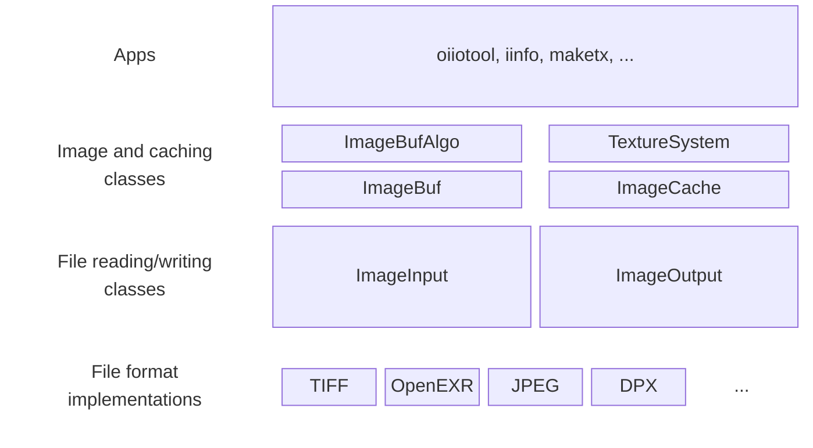

OpenImageIO's Architecture
==========================

## Core level / file abstraction: ImageInput and ImageOutput

At the heart of OpenImageIO are the `ImageInput` and `ImageOutput` classes,
which are the abstract interfaces for reading and writing image files using a
simple file-format-agnostic API. These classes provide a file-oriented
abstraction, with operations such as opening an image file, reading the
resolution and other metadata about the image in the file, reading or writing
scanlines or tiles to/from caller-provided memory, and closing the file.

All the details of the individual file formats and how the data is arranged or
stored in the file are hidden by these classes. Furthermore, when reading or
writing scanlines or tiles, the caller-side memory can use any of several
different common data types (sometimes called "data formats" or "formats" in
OIIO) such as `float`, `half`, 8 or 16 bit integers, etc. The `ImageInput` and
`ImageOutput` classes will automatically convert the data to or from the
format stored in the file.

This level of abstraction imposes some conceptual constraints on the
presentation of the image data, for the sake of simplification, so that every
application doesn't need to consider every possible combination of choices
that all the different file formats might make. For example, on the
"application side" of the `ImageInput` and `ImageOutput` classes, all images
have pixels that are 8- 16- or 32-bit int (signed or unsigned), 16- 32- or
64-bit float. If the pixel data in the file uses another data type, or a
number of bits per channel that is not 8, 16, or 32, those details are hidden
from the application. There are many other such simplifications.

## Low level: File format implementations

If the `ImageInput` and `ImageOutput` present the *interface* for reading and
writing image files, the implementations of each individual file format are
implemented in the file format plugins. (We call them "plugins" because it's
possible to organize them as an extensible list of dynamically loaded modules,
but all the common file formats have their plugins compiled into the
OpenImageIO library itself, so are not dynamically loaded and not generally
experienced as "plugins" in the usual sense.)

Each file format plugin consists of a concrete subclass of `ImageInput`, and
usually `ImageOutput`. Most format plugins are capable of both reading and
writing the file format, but some of them only include the reading portion.

## Higher level / Image abstraction: ImageBuf and ImageBufAlgo

For many applications, you just want to manipulate whole images, without
worrying about the details of opening and closing files, reading and writing
of individual scanlines or tiles, or how and where the pixel data is stored.
The `ImageBuf` class provides such an interface. It is a higher-level
abstraction that encapsulates an entire image.

For an ImageBuf that is meant to read an image file, it is simply told the
name of the file, and it will handle all the details of how and when to open,
close, and read the file, including handling all the combinations of tiles,
scanlines, and so on. Similarly, an ImageBuf can be written to an image file
on disk simply by providing the filename and telling it to `write()`, without
needing to specify any scanline-by-scanline instructions. The internal
implementation of ImageBuf uses ImageInput and ImageOutput to read and write
the image data from and to files, and so can read or write any file format for
which there is an ImageInput or ImageOutput plugin available.

ImageBuf typically owns the memory holding its pixel data and is responsible
for allocating and freeing it. Thus, file reads and writes are to/from this
internal memory, as opposed to ImageInput and ImageOutput, which must be
supplied with memory by the caller as the source or destination of the pixel
data. (That said, there is also a way to make an ImageBuf "wrap" memory owned
by the application rather than allocate internally.)

In addition to restricting the pixel data types to a limited set, ImageBuf
further imposes the simplification that all color channels are stored in the
same data type. This is a simplification that is not present in the ImageInput
and ImageOutput classes, which can handle files where different channels are
stored in different data types. For such a file, the ImageBuf will "promote"
all the channels of an image to a single same data type (usually the "widest"
or "most precise" used by any of its channels).

If `ImageBuf` is the in-memory representation of an entire image, then
`ImageBufAlgo` is a collection of algorithms that operate on `ImageBuf`
objects. These algorithms include simple operations like copying, resizing,
and compositing images, as well as more complex operations like color
conversions, resizing, filtering, etc.

## Image caching: TextureSystem and ImageCache

There are situations where ImageBuf is still not the right abstraction,
and you have so many images -- potentially tens of thousands of images
totalling multiple terabytes of pixel data -- that they can't possibly
be held in memory at once. This is actually a typical case for a
high-quality film renderer, where the renderer needs to be able to
access a texture data set of that size range.

In such cases, you want to handle both the pixel memory and the set of
open files as a *pool* centrally managed. This is done by the
`ImageCache` class. In short, it manages two central caches:

- A pool of image files currently held open, with a limit on the number of
  files that can be open at once (typically hundreds to thousands). When the
  limit is reached, a file that has not been accessed recently is closed to
  make room for a new file to be opened.

- A pool of pixel memory, organized into image *tiles*, with a limit on the
  total amount of tile memory to be used (typically a small number of GB).
  Accesses to pixel values check if the tile is in the cache, in which case no
  read from disk is necessary. If pixel access requires a tile not currently
  in the cache and the tile memory limit is reached, a tile that has not been
  accessed recently is evicted from the cache to make room for the new tile.

The TextureSystem is a level of abstraction above the ImageCache that further
adds the ability to do texture lookups with texture filtering, MIP-mapping,
and other features typical of texture mapping in a renderer.

## Command line applications

OpenImageIO has several command line utilities that use various combinations
of ImageBuf, ImageInput, and ImageOutput.

`oiiotool` is the most important of these (and technically can do everything
that the other tools can do, and more). It is a general-purpose image
manipulation tool that can read and write images, apply various image
operations, and write the results to disk.

Other command line tools include `iinfo` (which prints out information about
an image file), `iconvert` (which converts between different file formats),
and `maketx` (which generates tiled mipmaps in an efficient arrangement for
texture mapping in a renderer).

## Language Bindings

The main APIs, and the underlying implementation, are in C++ (currently
using C++17 features).

A Python binding is provided, currently using the pybind11 library to
generate the Python bindings for each C++ class or function.

There is an effort underway to eventually provide a Rust binding.

## Helper classes

Several image-related auxiliary classes are used by the public APIs of the
image- and file-oriented classes described above. The most important ones are:

- `ImageSpec` stores the specification for an image: its resolution, pixel data
  type, number of channels (as well as their names and individual data types),
  pixel and display windows, and all other metadata from the image file.
- `ParamValueList` is used to store a list of of name/value pairs (each
  individual name+value is a `ParamValue`), such as arbitrary image metadata.
- `ROI` describes a region of interest: the x, y, z, and channel range of
  pixels on which to perform some operation.

 Additionally, there are many small utility classes that are not about images
 per se, but also are used by the public interfaces of our main image classes.
 A few of them that you will see commonly used are:

 - `string_view` is a non-owning reference to a string (of any of several
   types, or partial substrings thereof), akin to `std::string_view` in C++17.
 - `span` is a non-owning reference to a contiguous sequence of objects, akin
   to `std::span` in C++20.
- `ustring` is a string class where the characters are stored in an internal
  shared pool of strings, so all ustrings that have the same character
  sequence point to the same character memory. In addition to saving memory,
  this makes string assignment and equality comparison as inexpensive as
  integer operations.
