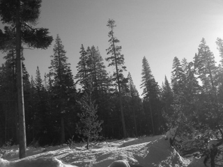
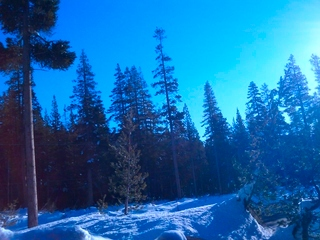

..
  Copyright Contributors to the OpenImageIO project.
  SPDX-License-Identifier: CC-BY-4.0

.. _chap-imagebufalgo:

ImageBufAlgo: Image Processing
##############################

ImageBufAlgo is a set of image processing functions that operate on
ImageBuf's. The functions are declared in the header file
:file:`OpenImageIO/imagebufalgo.h` and are declared in the
`namespace ImageBufAlgo`.

ImageBufAlgo common principles
==============================

.. .. doxygengroup: ImageBufAlgo_intro
   Do I like the above one better?

This section explains the general rules common to all ImageBufAlgo
functions. Only exceptions to these rules will be explained in the
subsequent listings of all the individual ImageBufAlgo functions.

Return values and error messages
^^^^^^^^^^^^^^^^^^^^^^^^^^^^^^^^

Most ImageBufAlgo functions that produce image data come in two forms:

1. Return an ImageBuf.

   The return value is a new ImageBuf containing the result image. In this
   case, an entirely new image will be created to hold the result. In case of
   error, the result image returned can have any error conditions checked with
   `has_error()` and `geterror()`.

   .. tabs::

      .. tab:: C++
            .. literalinclude:: ../../testsuite/docs-examples-cpp/src/docs-examples-imagebufalgo.cpp
             :language: c++
             :start-after: BEGIN-imagebufalgo-output-error1
             :end-before: END-imagebufalgo-output-error1
             :dedent: 4

      .. tab:: Python
         .. literalinclude:: ../../testsuite/docs-examples-python/src/docs-examples-imagebufalgo.py
             :language: py
             :start-after: BEGIN-imagebufalgo-output-error1
             :end-before: END-imagebufalgo-output-error1
             :dedent: 4

2. Pass a destination ImageBuf reference as the first parameter.
   
   The function is passed a *destination* ImageBuf where the results will
   be stored, and the return value is a `bool` that is `true` if the
   function succeeds or `false` if the function fails. Upon failure, the
   destination ImageBuf (the one that is being altered) will have an error
   message set.

   .. tabs::

      .. tab:: C++
            .. literalinclude:: ../../testsuite/docs-examples-cpp/src/docs-examples-imagebufalgo.cpp
             :language: c++
             :start-after: BEGIN-imagebufalgo-output-error2
             :end-before: END-imagebufalgo-output-error2
             :dedent: 4

      .. tab:: Python
         .. literalinclude:: ../../testsuite/docs-examples-python/src/docs-examples-imagebufalgo.py
             :language: py
             :start-after: BEGIN-imagebufalgo-output-error2
             :end-before: END-imagebufalgo-output-error2
             :dedent: 4

The first option (return an ImageBuf directly) is a more compact and
intuitive notation that is natural for most simple uses. But the second
option (pass an `ImageBuf&` referring to an existing destination) offers
additional flexibility, including more careful control over allocations, the
ability to partially overwrite regions of an existing image, and the ability
for the destination image to also be one of the input images (for example,
`add(A,A,B)` adds B into existing image A, with no third image allocated at
all).

For a small minority of ImageBufAlgo functions, there are only input images,
and no image outputs (e.g., `isMonochrome()`).  In such cases, the error
message should be retrieved from the first input image.

Region of interest
^^^^^^^^^^^^^^^^^^

Most ImageBufAlgo functions take an optional ROI parameter that restricts
the operation to a range in x, y, z, and channels. The default-constructed
ROI (also known as `ROI::All()`) means no region restriction -- the whole
image will be copied or altered.

For ImageBufAlgo functions that write into a destination ImageBuf parameter
and it is already initialized (i.e. allocated with a particular size and
data type), the operation will be performed on the pixels in the destination
that overlap the ROI, leaving pixels in the destination which are outside
the ROI unaltered.

For ImageBufAlgo functions that return an ImageBuf directly, or if their
`dst` parameter is an uninitialized ImageBuf, the ROI (if set) determines
the size of the result image. If the ROI is the default `All`, the result
image size will be the union of the pixel data windows of the input images
and have a data type determined by the data types of the input images.

Most ImageBufAlgo functions also respect the `chbegin` and `chend` members
of the ROI, thus restricting the channel range on which the operation is
performed.  The default ROI constructor sets up the ROI to specify that the
operation should be performed on all channels of the input image(s).

Constant and per-channel values
^^^^^^^^^^^^^^^^^^^^^^^^^^^^^^^

Many ImageBufAlgo functions take per-channel constant-valued arguments (for
example, a fill color). These parameters are passed as `cspan<float>`. These
are generally expected to have length equal to the number of channels. But
you may also pass a single float which will be used as the value for all
channels. (More generally, what is happening is that the last value supplied
is replicated for any missing channel.)

Some ImageBufAlgo functions have parameters of type `Image_or_Const`, which
may take either an ImageBuf reference, or a per-channel constant, or a
single constant to be used for all channels.

Multithreading
^^^^^^^^^^^^^^

All ImageBufAlgo functions take an optional `nthreads` parameter that
signifies the maximum number of threads to use to parallelize the
operation.  The default value for `nthreads` is 0, which signifies
that the number of thread should be the OIIO global default set by
`OIIO::attribute()` (see Section :ref:`sec-globalattribs`), which
itself defaults to be the detected level of hardware concurrency (number
of cores available).

Generally you can ignore this parameter (or pass 0), meaning to use all
the cores available in order to perform the computation as quickly as
possible.  The main reason to explicitly pass a different number
(generally 1) is if the application is multithreaded at a high level,
and the thread calling the ImageBufAlgo function just wants to continue doing
the computation without spawning additional threads, which might tend to
crowd out the other application threads.

.. _sec-iba-patterns:

Pattern generation
==================

For the ImageBufAlgo functions in this section, there is no "source" image.
Therefore, either an initialized `dst` must be supplied (to give a pre-
allocated size and data type of the image), or else it is strictly necessary
to supply an ROI parameter to specify the size of the new image (the data
type in this case will always be `float`). It is an error if one of the
pattern generation ImageBufAlgo functions is neither supplied a
pre-allocated `dst` nor a non-default ROI.

zero() -- create a black image
^^^^^^^^^^^^^^^^^^^^^^^^^^^^^^^^^^^^^^^^^^^^

.. doxygenfunction:: zero(ROI roi, int nthreads = 0)

..

  Result-as-parameter version:

    .. doxygenfunction:: zero(ImageBuf &dst, ROI roi = {}, int nthreads = 0)

  Examples:

    .. tabs::

       .. tab:: C++
             .. literalinclude:: ../../testsuite/docs-examples-cpp/src/docs-examples-imagebufalgo.cpp
              :language: c++
              :start-after: BEGIN-imagebufalgo-zero
              :end-before: END-imagebufalgo-zero
              :dedent: 4

       .. tab:: Python
          .. literalinclude:: ../../testsuite/docs-examples-python/src/docs-examples-imagebufalgo.py
              :language: py
              :start-after: BEGIN-imagebufalgo-zero
              :end-before: END-imagebufalgo-zero
              :dedent: 4

       .. code-tab:: bash oiiotool

          # Create a new 3-channel, 512x512 float image filled with 0.0 values.
          oiiotool --create 512x512 3 -d float -o out.exr

          # Zero out an existing image, keeping it the same size and data type.
          # For simplicity, just scale all values by 0.0
          oiiotool in.exr --mulc 0.0 -o out.exr

          # Zero out just the green channel, leave everything else the same.
          # Again, rely on --mulc to scale the channels
          oiiotool in.exr --mulc 1,0,1 -o out.exr

          # Zero out a rectangular region of an existing image
          oiiotool in.exr --fill:color=0,0,0 100x100+0+0 -o out.exr

|

fill() -- fill a region with a solid color or gradient
^^^^^^^^^^^^^^^^^^^^^^^^^^^^^^^^^^^^^^^^^^^^^^^^^^^^^^^^^^^^^^^^^^^^

.. doxygengroup:: fill
..

  Examples:

    .. tabs::

       .. tab:: C++
             .. literalinclude:: ../../testsuite/docs-examples-cpp/src/docs-examples-imagebufalgo.cpp
              :language: c++
              :start-after: BEGIN-imagebufalgo-fill
              :end-before: END-imagebufalgo-fill
              :dedent: 4

       .. tab:: Python
          .. literalinclude:: ../../testsuite/docs-examples-python/src/docs-examples-imagebufalgo.py
              :language: py
              :start-after: BEGIN-imagebufalgo-fill
              :end-before: END-imagebufalgo-fill
              :dedent: 4

       .. code-tab:: bash oiiotool
  
          # Create a new 640x480 RGB image, with a top-to-bottom gradient
          # from red to pink
          oiiotool --pattern fill:top=1,0.7,0.7:bottom=1,0,0 640x480 3 -o A.exr

          # Draw a filled red rectangle overtop existing image A.exr
          oiiotool A.exr --pattern fill:color=1,0,0 25x75 3 --paste +50+100 -o A.exr

  .. image:: figures/fill.jpg
        :align: center
        :width: 2.0 in

|

checker() -- make a checker pattern
^^^^^^^^^^^^^^^^^^^^^^^^^^^^^^^^^^^

.. doxygenfunction:: checker(int width, int height, int depth, cspan<float> color1, cspan<float> color2, int xoffset, int yoffset, int zoffset, ROI roi, int nthreads = 0)
..

  Result-as-parameter version:

    .. doxygenfunction:: checker(ImageBuf &dst, int width, int height, int depth, cspan<float> color1, cspan<float> color2, int xoffset = 0, int yoffset = 0, int zoffset = 0, ROI roi = {}, int nthreads = 0)

  Examples:

    .. tabs::
  
       .. tab:: C++
             .. literalinclude:: ../../testsuite/docs-examples-cpp/src/docs-examples-imagebufalgo.cpp
              :language: c++
              :start-after: BEGIN-imagebufalgo-checker
              :end-before: END-imagebufalgo-checker
              :dedent: 4

       .. tab:: Python
          .. literalinclude:: ../../testsuite/docs-examples-python/src/docs-examples-imagebufalgo.py
              :language: py
              :start-after: BEGIN-imagebufalgo-checker
              :end-before: END-imagebufalgo-checker
              :dedent: 4

       .. code-tab:: bash oiiotool
  
          # Create a new 640x480 RGB image, fill it with a two-toned gray
          # checkerboard, the checkers being 64x64 pixels each.
          oiiotool --pattern checker:width=64:color1=0.1,0.1,0.1:color2=0.4,0.4,0.4 640x480 3 -o A.exr

  .. image:: figures/checker.jpg
        :align: center
        :width: 2.0in

|

Noise patterns
^^^^^^^^^^^^^^

.. doxygenfunction:: noise(string_view noisetype, float A = 0.0f, float B = 0.1f, bool mono = false, int seed = 0, ROI roi = {}, int nthreads = 0)
..

  Result-as-parameter version:

    .. doxygenfunction:: noise(ImageBuf &dst, string_view noisetype, float A = 0.0f, float B = 0.1f, bool mono = false, int seed = 0, ROI roi = {}, int nthreads = 0)

  Examples:

    .. tabs::

       .. tab:: C++
             .. literalinclude:: ../../testsuite/docs-examples-cpp/src/docs-examples-imagebufalgo.cpp
              :language: c++
              :start-after: BEGIN-imagebufalgo-noise1
              :end-before: END-imagebufalgo-noise1
              :dedent: 4

       .. tab:: Python
          .. literalinclude:: ../../testsuite/docs-examples-python/src/docs-examples-imagebufalgo.py
              :language: py
              :start-after: BEGIN-imagebufalgo-noise1
              :end-before: END-imagebufalgo-noise1
              :dedent: 4

       .. code-tab:: bash oiiotool
  
          # Create a new 256x256 field of grayscale white noise on [0,1)
          oiiotool --pattern noise:type=uniform:mono=1:seed=1 256x256 3 -o A.exr
      
          # Create a new 256x256 field of grayscale blue noise on [0,1)
          oiiotool --pattern noise:type=blue:mono=1:seed=1 256x256 3 -o B.exr
      
          # Add color Gaussian noise to an existing image
          oiiotool tahoe.jpg --noise:type=gaussian:stddev=0.1 -o C.exr
      
          # Use salt and pepper noise to make occasional random dropouts
          oiiotool tahoe.jpg --noise:type=salt:value=0:portion=0.01:mono=1 -o D.exr

  ..

  .. |noiseimg1| image:: figures/unifnoise1.jpg
     :height: 1.25 in
  .. |noiseimg2| image:: figures/bluenoise.jpg
     :height: 1.25 in
  .. |noiseimg3| image:: figures/tahoe-gauss.jpg
     :height: 1.5 in
  .. |noiseimg4| image:: figures/tahoe-pepper.jpg
     :height: 1.5 in

  ..

    +------------------------+------------------------+------------------------+------------------------+
    | |noiseimg1|            | |noiseimg2|            | |noiseimg3|            | |noiseimg4|            |
    +------------------------+------------------------+------------------------+------------------------+
    | white noise            | blue noise             | gaussian noise added   | salt & pepper dropouts |
    +------------------------+------------------------+------------------------+------------------------+

|

.. doxygenfunction:: bluenoise_image()
..

  Example:

    .. tabs::

       .. tab:: C++
             .. literalinclude:: ../../testsuite/docs-examples-cpp/src/docs-examples-imagebufalgo.cpp
              :language: c++
              :start-after: BEGIN-imagebufalgo-noise2
              :end-before: END-imagebufalgo-noise2
              :dedent: 4

       .. tab:: Python
          .. literalinclude:: ../../testsuite/docs-examples-python/src/docs-examples-imagebufalgo.py
              :language: py
              :start-after: BEGIN-imagebufalgo-noise2
              :end-before: END-imagebufalgo-noise2
              :dedent: 4

Drawing shapes: points, lines, boxes
^^^^^^^^^^^^^^^^^^^^^^^^^^^^^^^^^^^^

.. doxygenfunction:: render_point
..

  Examples:

    .. tabs::

       .. tab:: C++
             .. literalinclude:: ../../testsuite/docs-examples-cpp/src/docs-examples-imagebufalgo.cpp
              :language: c++
              :start-after: BEGIN-imagebufalgo-point
              :end-before: END-imagebufalgo-point
              :dedent: 4

       .. tab:: Python
          .. literalinclude:: ../../testsuite/docs-examples-python/src/docs-examples-imagebufalgo.py
              :language: py
              :start-after: BEGIN-imagebufalgo-point
              :end-before: END-imagebufalgo-point
              :dedent: 4

       .. code-tab:: bash oiiotool
  
          oiiotool A.exr -point:color=1,0,0,1 50,100 -o out.exr

|

.. doxygenfunction:: render_line
..

  Examples:

    .. tabs::

       .. tab:: C++
             .. literalinclude:: ../../testsuite/docs-examples-cpp/src/docs-examples-imagebufalgo.cpp
              :language: c++
              :start-after: BEGIN-imagebufalgo-lines
              :end-before: END-imagebufalgo-lines
              :dedent: 4

       .. tab:: Python
          .. literalinclude:: ../../testsuite/docs-examples-python/src/docs-examples-imagebufalgo.py
              :language: py
              :start-after: BEGIN-imagebufalgo-lines
              :end-before: END-imagebufalgo-lines
              :dedent: 4

       .. code-tab:: bash oiiotool
  
          oiiotool A.exr -line:color=1,0,0,1 10,60,20,100 -o out.exr

  .. image:: figures/lines.png
    :align: center
    :width: 2.0 in

|

.. doxygenfunction:: render_box
..

  Examples:

    .. tabs::
  
       .. tab:: C++
             .. literalinclude:: ../../testsuite/docs-examples-cpp/src/docs-examples-imagebufalgo.cpp
              :language: c++
              :start-after: BEGIN-imagebufalgo-box
              :end-before: END-imagebufalgo-box
              :dedent: 4

       .. tab:: Python
          .. literalinclude:: ../../testsuite/docs-examples-python/src/docs-examples-imagebufalgo.py
              :language: py
              :start-after: BEGIN-imagebufalgo-box
              :end-before: END-imagebufalgo-box
              :dedent: 4

       .. code-tab:: bash oiiotool

          oiiotool A.exr -box:color=0,1,1,1 150,100,240,180 \
                         -box:color=0.5,0.5,0,0.5 100,50,180,140 -o out.exr

  .. image:: figures/box.png
    :align: center
    :width: 2.0 in

|

Drawing text
^^^^^^^^^^^^^^^^^^^^^^^^^^^^^^^^^^^^

.. doxygenfunction:: render_text(ImageBuf &dst, int x, int y, string_view text, int fontsize = 16, string_view fontname = "", cspan<float> textcolor = 1.0f, TextAlignX alignx = TextAlignX::Left, TextAlignY aligny = TextAlignY::Baseline, int shadow = 0, ROI roi = {}, int nthreads = 0)
..

  Examples:

    .. tabs::
  
       .. tab:: C++
             .. literalinclude:: ../../testsuite/docs-examples-cpp/src/docs-examples-imagebufalgo.cpp
              :language: c++
              :start-after: BEGIN-imagebufalgo-text1
              :end-before: END-imagebufalgo-text1
              :dedent: 4

       .. tab:: Python
          .. literalinclude:: ../../testsuite/docs-examples-python/src/docs-examples-imagebufalgo.py
              :language: py
              :start-after: BEGIN-imagebufalgo-text1
              :end-before: END-imagebufalgo-text1
              :dedent: 4

       .. code-tab:: bash oiiotool

          oiiotool ImgA.exr --text:x=50:y=100 "Hello, world" \
            --text:x=100:y=200:fontsize=60:fontname="Arial Bold":color=1,0,0,1 "Go Big Red!" \
            -o out.exr

          oiiotool ImgB.exr \
            --text:x=320:y=240:fontsize=60:fontname="Arial Bold":color=1,1,1,1:alignx=center:aligny=center "Centered" \
            -o out.exr

.. |textimg1| image:: figures/text.jpg
   :width: 2.5 in
.. |textimg2| image:: figures/textcentered.jpg
   :width: 2.5 in
..

  +-----------------+-----------------+
  | |textimg1|      | |textimg2|      |
  +-----------------+-----------------+

|

.. doxygenfunction:: text_size
..

  Examples:

    .. tabs::
  
       .. tab:: C++
             .. literalinclude:: ../../testsuite/docs-examples-cpp/src/docs-examples-imagebufalgo.cpp
              :language: c++
              :start-after: BEGIN-imagebufalgo-text2
              :end-before: END-imagebufalgo-text2
              :dedent: 4

       .. tab:: Python
          .. literalinclude:: ../../testsuite/docs-examples-python/src/docs-examples-imagebufalgo.py
              :language: py
              :start-after: BEGIN-imagebufalgo-text2
              :end-before: END-imagebufalgo-text2
              :dedent: 4

.. _sec-iba-transforms:

Image transformations and data movement
=======================================

Shuffling channels
^^^^^^^^^^^^^^^^^^^^^^^^^^^^^^^^^^^^

.. doxygenfunction:: channels(const ImageBuf &src, int nchannels, cspan<int> channelorder, cspan<float> channelvalues = {}, cspan<std::string> newchannelnames = {}, bool shuffle_channel_names = false, int nthreads = 0)
..

  Result-as-parameter version:

    .. doxygenfunction:: channels(ImageBuf &dst, const ImageBuf &src, int nchannels, cspan<int> channelorder, cspan<float> channelvalues = {}, cspan<std::string> newchannelnames = {}, bool shuffle_channel_names = false, int nthreads = 0)

  Examples:

    .. tabs::
  
       .. code-tab:: c++
  
          // Copy the first 3 channels of an RGBA, drop the alpha
          ImageBuf RGBA (...);   // assume it's initialized, 4 chans
          ImageBuf RGB = ImageBufAlgo::channels (RGBA, 3, {} /*default ordering*/);
      
          // Copy just the alpha channel, making a 1-channel image
          ImageBuf Alpha = ImageBufAlgo::channels (RGBA, 1, 3 /*alpha_channel*/);
      
          // Swap the R and B channels
          int channelorder[] = { 2 /*B*/, 1 /*G*/, 0 /*R*/, 3 /*A*/ };
          ImageBuf BRGA = ImageBufAlgo::channels (BRGA, RGBA, 4, channelorder);
      
          // Add an alpha channel with value 1.0 everywhere to an RGB image,
          // keep the other channels with their old ordering, values, and
          // names.
          int channelorder[] = { 0, 1, 2, -1 /*use a float value*/ };
          float channelvalues[] = { 0 /*ignore*/, 0 /*ignore*/, 0 /*ignore*/, 1.0 };
          std::string channelnames[] = { "", "", "", "A" };
          ImageBuf RGBA = ImageBufAlgo::channels (RGB, 4, channelorder,
                                                  channelvalues, channelnames);
      
       .. code-tab:: py

          # Copy the first 3 channels of an RGBA, drop the alpha
          RGBA = ImageBuf(...)   # assume it's initialized, 4 chans
          RGB = ImageBufAlgo.channels (RGBA, (0, 1, 2))
      
          # Copy just the alpha channel, making a 1-channel image
          Alpha = ImageBufAlgo.channels (RGBA, ("A",))
      
          # Swap the R and B channels
          BRGA = ImageBufAlgo.channels (BRGA, RGBA, (2, 1, 0, 3))
      
          # Add an alpha channel with value 1.0 everywhere to an RGB image,
          # keep the other channels with their old ordering, values, and
          # names.
          RGBA = ImageBufAlgo.channels (RGB, (0, 1, 2, 1.0),
                                        newchannelnames=("", "", "", "A"))
      
       .. code-tab:: bash oiiotool

          # Copy the first 3 channels of an RGBA, drop the alpha
          oiiotool RGBA.exr -ch R,G,B -o RGB.exr
      
          # Copy just the alpha channel, making a 1-channel image
          oiiotool RGBA.exr -ch A -o A.exr
      
          # Swap the R and B channels
          oiiotool RGBA.exr -ch R=B,G,B=R,A -o BGRA.exr
      
          # Add an alpha channel with value 1.0 everywhere to an RGB image,
          # keep the other channels with their old ordering, values, and
          # names.
          oiiotool RGB.exr -ch 0,1,2,1.0 -o RGBA.exr
      
|

.. doxygenfunction:: channel_append(const ImageBuf &A, const ImageBuf &B, ROI roi = {}, int nthreads = 0)
..

  Result-as-parameter version:

    .. doxygenfunction:: channel_append(ImageBuf &dst, const ImageBuf &A, const ImageBuf &B, ROI roi = {}, int nthreads = 0)

  Examples:

    .. tabs::
  
       .. code-tab:: c++
  
          ImageBuf RGBA ("rgba.exr");
          ImageBuf Z ("z.exr");
          ImageBuf RGBAZ = ImageBufAlgo::channel_append (RGBA, Z);

       .. code-tab:: py
  
          RGBA = ImageBuf("rgba.exr")
          Z = ImageBuf("z.exr")
          RGBAZ = ImageBufAlgo.channel_append (RGBA, Z)

       .. code-tab:: bash oiiotool

          oiiotool rgba.exr z.exr --chappend -o rgbaz.exr

|

.. doxygenfunction:: copy(const ImageBuf &src, TypeDesc convert = TypeUnknown, ROI roi = {}, int nthreads = 0)
..

  Result-as-parameter version:

    .. doxygenfunction:: copy(ImageBuf &dst, const ImageBuf &src, TypeDesc convert = TypeUnknown, ROI roi = {}, int nthreads = 0)

  Examples:

    .. tabs::
  
       .. code-tab:: c++
  
          // Set B to be a copy of A, but converted to float
          ImageBuf A ("A.exr");
          ImageBuf B = ImageBufAlgo::copy (A, TypeDesc::FLOAT);

       .. code-tab:: py
  
          # Set B to be a copy of A, but converted to float
          A = ImageBuf("A.exr")
          B = ImageBufAlgo.copy (A, convert="float")

       .. code-tab:: bash oiiotool
  
          # Convert A to float pixels
          oiiotool A.exr -d float -o B.exr

|

.. doxygenfunction:: crop(const ImageBuf &src, ROI roi = {}, int nthreads = 0)
..

  Result-as-parameter version:

    .. doxygenfunction:: crop(ImageBuf &dst, const ImageBuf &src, ROI roi = {}, int nthreads = 0)

  Examples:

    .. tabs::
  
       .. code-tab:: c++
  
          // Set B to be a 200x100 region of A starting at (50,50), trimming
          // the exterior away but leaving that region in its original position.
          ImageBuf A ("A.exr");
          ImageBuf B = ImageBufAlgo::crop (A, ROI(50,250,50,150));

       .. code-tab:: py
  
          # Set B to be a 200x100 region of A starting at (50,50), trimming
          # the exterior away but leaving that region in its original position.
          A = ImageBuf("A.exr")
          B = ImageBufAlgo.crop (A, ROI(50,250,50,150));

       .. code-tab:: bash oiiotool
  
          # Set B to be a 200x100 region of A starting at (50,50), trimming
          # the exterior away but leaving that region in its original position.
          oiiotool A.exr --crop 200x100+50+50 -o B.exr

|

.. doxygenfunction:: cut(const ImageBuf &src, ROI roi = {}, int nthreads = 0)
..

  Result-as-parameter version:

    .. doxygenfunction:: cut(ImageBuf &dst, const ImageBuf &src, ROI roi = {}, int nthreads = 0)

  Examples:

    .. tabs::
  
       .. code-tab:: c++
  
          // Set B to be a 200x100 region of A starting at (50,50), but
          // moved to the upper left corner so its new origin is (0,0).
          ImageBuf A ("A.exr");
          ImageBuf B = ImageBufAlgo::cut (A, ROI(50,250,50,150));

       .. code-tab:: py
  
          # Set B to be a 200x100 region of A starting at (50,50), but
          # moved to the upper left corner so its new origin is (0,0).
          A = ImageBuf("A.exr")
          B = ImageBufAlgo.cut (A, ROI(50,250,50,150))

       .. code-tab:: bash oiiotool
  
          # Set B to be a 200x100 region of A starting at (50,50), but
          # moved to the upper left corner so its new origin is (0,0).
          oiiotool A.exr --cut 200x100+50+50 -o B.exr

|

.. doxygenfunction:: paste
..

  Examples:

    .. tabs::
  
       .. code-tab:: c++
  
          // Paste fg.exr on top of bg.exr, offset by (100,100)
          ImageBuf Bg ("bg.exr");
          ImageBuf Fg ("fg.exr");
          ImageBufAlgo::paste (Bg, 100, 100, 0, 0, fg);

       .. code-tab:: py
  
          # Paste fg.exr on top of bg.exr, offset by (100,100)
          Bg = ImageBuf("bg.exr")
          Fg = ImageBuf("fg.exr")
          ImageBufAlgo.paste (Bg, 100, 100, 0, 0, Fg)

       .. code-tab:: bash oiiotool
  
          # Paste fg.exr on top of bg.exr, offset by (100,100)
          oiiotool bg.exr fg.exr --paste +100+100 -o bg.exr

.. doxygengroup:: rotateN
..

  Examples:

    .. tabs::
  
       .. code-tab:: c++
  
          ImageBuf A ("grid.jpg");
          ImageBuf R90 = ImageBufAlgo::rotate90 (A);
          ImageBuf R180 = ImageBufAlgo::rotate180 (A);
          ImageBuf R270 = ImageBufAlgo::rotate270 (A);

       .. code-tab:: py
  
          A = ImageBuf("grid.jpg")
          R90 = ImageBufAlgo.rotate90 (A)
          R180 = ImageBufAlgo.rotate180 (A)
          R270 = ImageBufAlgo.rotate270 (A)

       .. code-tab:: bash oiiotool
  
          oiiotool grid.jpg -rotate 90 -o R90.jpg
          oiiotool grid.jpg -rotate 180 -o R180.jpg
          oiiotool grid.jpg -rotate 270 -o R270.jpg

.. |rotimg1| image:: figures/grid-small.jpg
   :width: 1.5 in
.. |rotimg2| image:: figures/rotate90.jpg
   :width: 1.5 in
.. |rotimg3| image:: figures/rotate180.jpg
   :width: 1.5 in
.. |rotimg4| image:: figures/rotate270.jpg
   :width: 1.5 in
..

  +-------------+-------------+-------------+-------------+
  | |rotimg1|   | |rotimg2|   | |rotimg3|   | |rotimg4|   |
  +-------------+-------------+-------------+-------------+
  | original    | rotated 90  | rotated 180 | rotated 270 |
  +-------------+-------------+-------------+-------------+

.. doxygengroup:: flip-flop-transpose
..

  Examples:

    .. tabs::
  
       .. code-tab:: c++
  
          ImageBuf A ("grid.jpg");
          ImageBuf B;
          B = ImageBufAlgo::flip (A);
          B = ImageBufAlgo::flop (A);
          B = ImageBufAlgo::transpose (A);

       .. code-tab:: py
  
          A = ImageBuf("grid.jpg")
          B = ImageBufAlgo.flip (A)
          B = ImageBufAlgo.flop (A)
          B = ImageBufAlgo.transpose (A)

       .. code-tab:: bash oiiotool
  
          oiiotool grid.jpg --flip -o flip.jpg
          oiiotool grid.jpg --flop -o flop.jpg
          oiiotool grid.jpg --transpose -o transpose.jpg

.. |flipimg1| image:: figures/grid-small.jpg
   :width: 1.5 in
.. |flipimg2| image:: figures/flip.jpg
   :width: 1.5 in
.. |flipimg3| image:: figures/flop.jpg
   :width: 1.5 in
.. |flipimg4| image:: figures/transpose.jpg
   :width: 1.5 in
..

  +-------------+-------------+-------------+-------------+
  | |flipimg1|  | |flipimg2|  | |flipimg3|  | |flipimg4|  |
  +-------------+-------------+-------------+-------------+
  | original    | flip        | flop        | transpose   |
  +-------------+-------------+-------------+-------------+

.. doxygenfunction:: reorient(const ImageBuf &src, int nthreads = 0)
..

  Result-as-parameter version:

    .. doxygenfunction:: reorient(ImageBuf &dst, const ImageBuf &src, int nthreads = 0)

  Examples:

    .. tabs::
  
       .. code-tab:: c++

          ImageBuf A ("tahoe.jpg");
          A = ImageBufAlgo::reorient (A);

       .. code-tab:: py

          A = ImageBuf("tahoe.jpg")
          A = ImageBufAlgo.reorient (A)

       .. code-tab:: bash oiiotool

          oiiotool tahoe.jpg --reorient -o out.jpg

|

.. doxygenfunction:: circular_shift(const ImageBuf &src, int xshift, int yshift, int zshift = 0, ROI roi = {}, int nthreads = 0)
..

  Result-as-parameter version:

  .. doxygenfunction:: circular_shift(ImageBuf &dst, const ImageBuf &src, int xshift, int yshift, int zshift = 0, ROI roi = {}, int nthreads = 0)
  ..

  Examples:

    .. tabs::
  
       .. tab:: C++

          .. literalinclude:: ../../testsuite/docs-examples-cpp/src/docs-examples-imagebufalgo.cpp
             :language: c++
             :start-after: BEGIN-imagebufalgo-cshift
             :end-before: END-imagebufalgo-cshift
             :dedent: 4

       .. tab:: Python

          .. literalinclude:: ../../testsuite/docs-examples-python/src/docs-examples-imagebufalgo.py
             :language: c++
             :start-after: BEGIN-imagebufalgo-cshift
             :end-before: END-imagebufalgo-cshift
             :dedent: 4

       .. tab:: oiiotool

          .. code-block:: bash

             oiiotool tahoe.jpg --cshift +70+30 -o out.jpg

.. |cshiftimg1| image:: figures/grid-small.jpg
   :width: 2.0 in
.. |cshiftimg2| image:: figures/cshift.jpg
   :width: 2.0 in
..

  +-----------------+-----------------+
  | |cshiftimg1|    | |cshiftimg2|    |
  +-----------------+-----------------+

|

.. doxygengroup:: rotate
..

  Examples:

    .. tabs::
  
       .. code-tab:: c++

          ImageBuf Src ("tahoe.exr");
          ImageBuf Dst = ImageBufAlgo::rotate (Src, 45.0);

       .. code-tab:: py

          Src = ImageBuf("tahoe.exr")
          Dst = ImageBufAlgo.rotate (Src, 45.0)

       .. code-tab:: bash oiiotool

          oiiotool tahoe.exr --rotate 45.0 -o out.exr

.. |rotateimg1| image:: figures/grid-small.jpg
   :width: 2.0 in
.. |rotateimg2| image:: figures/rotate45.jpg
   :width: 2.0 in
..

  +-----------------+-----------------+
  | |rotateimg1|    | |rotateimg2|    |
  +-----------------+-----------------+

|

.. doxygengroup:: resize
..

  Examples:

    .. tabs::
  
       .. code-tab:: c++

          // Resize the image to 640x480, using the default filter
          ImageBuf Src ("tahoe.exr");
          ROI roi (0, 640, 0, 480, 0, 1, /*chans:*/ 0, Src.nchannels());
          ImageBuf Dst = ImageBufAlgo::resize (Src, "", 0, roi);

       .. code-tab:: py

          # Resize the image to 640x480, using the default filter
          Src = ImageBuf("tahoe.exr")
          roi = ROI(0, 640, 0, 480, 0, 1, 0, Src.nchannels)
          Dst = ImageBufAlgo.resize (Src, roi=roi)

       .. code-tab:: bash oiiotool

          # Resize the image to 640x480, using the default filter
          oiiotool tahoe.exr --resize 640x480 -o out.exr

|

.. doxygenfunction:: resample(const ImageBuf &src, bool interpolate = true, ROI roi = {}, int nthreads = 0)
..

  Result-as-parameter version:

  .. doxygenfunction:: resample(ImageBuf &dst, const ImageBuf &src, bool interpolate = true, ROI roi = {}, int nthreads = 0)
  ..

  Examples:

    .. tabs::
  
       .. code-tab:: c++

          // Resample quickly to 320x240, with default interpolation
          ImageBuf Src ("tahoe.exr");
          ROI roi (0, 320, 0, 240, 0, 1, /*chans:*/ 0, Src.nchannels());
          ImageBuf Dst = ImageBufAlgo::resiresampleze (Src, true, roi);

       .. code-tab:: py

          # Resample quickly to 320x240, with default interpolation
          Src = ImageBuf("tahoe.exr")
          roi = ROI(0, 320, 0, 240, 0, 1, 0, Src.nchannels)
          Dst = ImageBufAlgo.resample (Src, roi=roi)

       .. code-tab:: bash oiiotool

          # Resample quickly to 320x240, with default interpolation
          oiiotool tahoe.exr --resample 320x240 -o out.exr

|

.. doxygengroup:: fit
..

  Examples:

    .. tabs::
  
       .. code-tab:: c++

          // Resize to fit into a max of 640x480, preserving the aspect ratio
          ImageBuf Src ("tahoe.exr");
          ROI roi (0, 640, 0, 480, 0, 1, /*chans:*/ 0, Src.nchannels());
          ImageBuf Dst = ImageBufAlgo::fit (Src, "", 0, true, roi);

       .. code-tab:: py

          # Resize to fit into a max of 640x480, preserving the aspect ratio
          Src = ImageBuf("tahoe.exr")
          roi = ROI(0, 640, 0, 480, 0, 1, 0, Src.nchannels)
          Dst = ImageBufAlgo.fit (Src, "", 0, True, roi)

       .. code-tab:: bash oiiotool

          # Resize to fit into a max of 640x480, preserving the aspect ratio
          oiiotool tahoe.exr --fit 640x480 -o out.exr

|

.. doxygengroup:: warp
..

  Examples:

    .. tabs::
  
       .. code-tab:: c++

          Imath::M33f M ( 0.7071068, 0.7071068, 0,
                         -0.7071068, 0.7071068, 0,
                         20,        -8.284271,  1);
          ImageBuf Src ("tahoe.exr");
          ImageBuf Dst = ImageBufAlgo::warp (dst, src, M, "lanczos3");

       .. code-tab:: py

          M = ( 0.7071068, 0.7071068, 0,
               -0.7071068, 0.7071068, 0,
                20,        -8.284271, 1)
          Src = ImageBuf("tahoe.exr")
          Dst = ImageBufAlgo.warp (dst, src, M, "lanczos3");

       .. code-tab:: bash oiiotool

          oiiotool tahoe.exr --warp 0.7071068,0.7071068,0,-0.7071068,0.7071068,0,20,-8.284271,1 -o out.exr

|

.. _sec-iba-arith:

Image arithmetic
================

.. doxygenfunction:: add(Image_or_Const A, Image_or_Const B, ROI roi = {}, int nthreads = 0)
..

  Result-as-parameter version:

    .. doxygenfunction:: add(ImageBuf &dst, Image_or_Const A, Image_or_Const B, ROI roi = {}, int nthreads = 0)

  Examples:

    .. tabs::
  
       .. code-tab:: c++

          // Add images A and B
          ImageBuf A ("a.exr");
          ImageBuf B ("b.exr");
          ImageBuf Sum = ImageBufAlgo::add (A, B);
      
          // Add 0.2 to channels 0-2, but not to channel 3
          ImageBuf Sum = ImageBufAlgo::add (A, { 0.2f, 0.2f, 0.2f, 0.0f });

       .. code-tab:: py

          # Add images A and B
          A = ImageBuf("a.exr")
          B = ImageBuf("b.exr")
          sum = ImageBufAlgo.add (A, B)

          # Add 0.2 to channels 0-2, but not to channel 3
          Sum = ImageBufAlgo.add (A, (0.2, 0.2, 0.2, 0.0))

       .. code-tab:: bash oiiotool

          # Add images A and B
          oiiotool a.exr b.exr --add -o sum.exr

          # Add 0.2 to channels 0-2, but not to channel 3
          oiiotool a.exr --addc 0.2,0.2,0.2,0.0 -o sum.exr

|

.. doxygenfunction:: sub(Image_or_Const A, Image_or_Const B, ROI roi = {}, int nthreads = 0)
..

  Result-as-parameter version:

    .. doxygenfunction:: sub(ImageBuf &dst, Image_or_Const A, Image_or_Const B, ROI roi = {}, int nthreads = 0)

  Examples:

    .. tabs::
  
       .. code-tab:: c++

          ImageBuf A ("a.exr");
          ImageBuf B ("b.exr");
          ImageBuf Diff = ImageBufAlgo::sub (A, B);

       .. code-tab:: py

          A = ImageBuf("a.exr")
          B = ImageBuf("b.exr")
          Diff = ImageBufAlgo.sub (A, B)

       .. code-tab:: bash oiiotool

          oiiotool a.exr b.exr --sub -o diff.exr

|

.. doxygenfunction:: absdiff(Image_or_Const A, Image_or_Const B, ROI roi = {}, int nthreads = 0)
..

  Result-as-parameter version:

    .. doxygenfunction:: absdiff(ImageBuf &dst, Image_or_Const A, Image_or_Const B, ROI roi = {}, int nthreads = 0)

  Examples:

    .. tabs::
  
       .. code-tab:: c++

          ImageBuf A ("a.exr");
          ImageBuf B ("b.exr");
          ImageBuf Diff = ImageBufAlgo::absdiff (A, B);

       .. code-tab:: py

          A = ImageBuf("a.exr")
          B = ImageBuf("b.exr")
          Diff = ImageBufAlgo.absdiff (A, B)

       .. code-tab:: bash oiiotool

          oiiotool a.exr b.exr --absdiff -o diff.exr

|

.. doxygenfunction:: abs(const ImageBuf &A, ROI roi = {}, int nthreads = 0)
..

  Result-as-parameter version:

    .. doxygenfunction:: abs(ImageBuf &dst, const ImageBuf &A, ROI roi = {}, int nthreads = 0)

  Examples:

    .. tabs::
  
       .. code-tab:: c++

          ImageBuf A ("a.exr");
          ImageBuf Abs = ImageBufAlgo::abs (A);

       .. code-tab:: py

          A = ImageBuf("a.exr")
          Abs = ImageBufAlgo.abs (A)

       .. code-tab:: bash oiiotool

          oiiotool a.exr --abs -o abs.exr

|

.. doxygenfunction:: mul(Image_or_Const A, Image_or_Const B, ROI roi = {}, int nthreads = 0)
..

  Result-as-parameter version:

    .. doxygenfunction:: mul(ImageBuf &dst, Image_or_Const A, Image_or_Const B, ROI roi = {}, int nthreads = 0)

  Examples:

    .. tabs::
  
       .. code-tab:: c++

          // Pixel-by-pixel, channel-by-channel multiplication of A and B
          ImageBuf A ("a.exr");
          ImageBuf B ("b.exr");
          ImageBuf Product = ImageBufAlgo::mul (A, B);

          // In-place reduce intensity of A's channels 0-2 by 50%
          ImageBufAlgo::mul (A, A, { 0.5f, 0.5f, 0.5f, 1.0f });

       .. code-tab:: py

          # Pixel-by-pixel, channel-by-channel multiplication of A and B
          A = ImageBuf("a.exr")
          B = ImageBuf("b.exr")
          Product = ImageBufAlgo.mul (A, B)

          # In-place reduce intensity of A's channels 0-2 by 50%
          ImageBufAlgo.mul (A, A, (0.5, 0.5, 0.5, 1.0))

       .. code-tab:: bash oiiotool

          # Pixel-by-pixel, channel-by-channel multiplication of A and B
          oiiotol a.exr b.exr --mul -o product.exr

          # In-place reduce intensity of A's channels 0-2 by 50%
          oiiotool a.exr --mulc 0.5,0.5,0.5,1.0 -o a.exr

|

.. doxygenfunction:: div(Image_or_Const A, Image_or_Const B, ROI roi = {}, int nthreads = 0)
..

  Result-as-parameter version:

    .. doxygenfunction:: div(ImageBuf &dst, Image_or_Const A, Image_or_Const B, ROI roi = {}, int nthreads = 0)

  Examples:

    .. tabs::
  
       .. code-tab:: c++

          // Pixel-by-pixel, channel-by-channel division of A by B
          ImageBuf A ("a.exr");
          ImageBuf B ("b.exr");
          ImageBuf Ratio = ImageBufAlgo::div (A, B);

          // In-place reduce intensity of A's channels 0-2 by 50%
          ImageBufAlgo::div (A, A, { 2.0f, 2.0f, 2.0f, 1.0f });

       .. code-tab:: py

          # Pixel-by-pixel, channel-by-channel division of A by B
          A = ImageBuf("a.exr")
          B = ImageBuf("b.exr")
          Ratio = ImageBufAlgo.div (A, B)

          # In-place reduce intensity of A's channels 0-2 by 50%
          ImageBufAlgo.div (A, A, (2.0, 2.0, 2.0, 1.0))

       .. code-tab:: bash oiiotool

          # Pixel-by-pixel, channel-by-channel division of A by B
          oiiotol a.exr b.exr --div -o ratio.exr

          # In-place reduce intensity of A's channels 0-2 by 50%
          oiiotool a.exr --divc 2,2,2,1 -o a.exr

|

.. doxygenfunction:: mad(Image_or_Const A, Image_or_Const B, Image_or_Const C, ROI roi = {}, int nthreads = 0)
..

  Result-as-parameter version:

    .. doxygenfunction:: mad(ImageBuf &dst, Image_or_Const A, Image_or_Const B, Image_or_Const C, ROI roi = {}, int nthreads = 0)

  Examples:

    .. tabs::
  
       .. code-tab:: c++

          // Pixel-by-pixel, channel-by-channel A * B + C
          ImageBuf A ("a.exr");
          ImageBuf B ("b.exr");
          ImageBuf C ("c.exr");
          ImageBuf Result = ImageBufAlgo::mad (A, B, C);

          // Compute the "inverse" A, which is 1.0-A, as A*(-1) + 1
          // Do this in-place, and only for the first 3 channels (leave any
          // alpha channel, if present, as it is).
          ImageBuf Ainv = ImageBufAlgo::mad (A, { -1.0, -1.0, -1.0, 1.0 },
                                                { 1.0, 1.0, 1.0, 0.0 });

       .. code-tab:: py

          # Pixel-by-pixel, channel-by-channel A * B + C
          A = ImageBuf("a.exr")
          B = ImageBuf("b.exr")
          C = ImageBuf("c.exr")
          Result = ImageBufAlgo.mad (A, B, C)

          # Compute the "inverse" A, which is 1.0-A, as A*(-1) + 1
          # Do this in-place, and only for the first 3 channels (leave any
          # alpha channel, if present, as it is).
          Ainv = ImageBufAlgo.mad (A, (-1.0, -1.0, -1.0, 1.0), (1.0, 1.0, 1.0, 0.0))

       .. code-tab:: bash oiiotool

          # Pixel-by-pixel, channel-by-channel A * B + C
          oiiotol a.exr b.exr c.exr --mad -o result.exr

|

.. doxygenfunction:: over(const ImageBuf &A, const ImageBuf &B, ROI roi = {}, int nthreads = 0)
..

  Result-as-parameter version:

    .. doxygenfunction:: over(ImageBuf &dst, const ImageBuf &A, const ImageBuf &B, ROI roi = {}, int nthreads = 0)

  Examples:

    .. tabs::
  
       .. code-tab:: c++

          ImageBuf A ("a.exr");
          ImageBuf B ("b.exr");
          ImageBuf Composite = ImageBufAlgo::over (A, B);

       .. code-tab:: c++

          A = ImageBuf("a.exr")
          B = ImageBuf("b.exr")
          Composite = ImageBufAlgo.over (A, B)

       .. code-tab:: bash oiiotool

          oiiotool a.exr b.exr --over -o composite.exr

|

.. doxygenfunction:: zover(const ImageBuf &A, const ImageBuf &B, bool z_zeroisinf = false, ROI roi = {}, int nthreads = 0)
..

  Result-as-parameter version:

    .. doxygenfunction:: zover(ImageBuf &dst, const ImageBuf &A, const ImageBuf &B, bool z_zeroisinf = false, ROI roi = {}, int nthreads = 0)

  Examples:

    .. tabs::
  
       .. code-tab:: c++

          ImageBuf A ("a.exr");
          ImageBuf B ("b.exr");
          ImageBuf Composite = ImageBufAlgo::zover (A, B);

       .. code-tab:: c++

          A = ImageBuf("a.exr")
          B = ImageBuf("b.exr")
          Composite = ImageBufAlgo.zover (A, B)

       .. code-tab:: bash oiiotool

          oiiotool a.exr b.exr --zover -o composite.exr

|

.. doxygenfunction:: invert(const ImageBuf &A, ROI roi = {}, int nthreads = 0)
..

  Result-as-parameter version:

    .. doxygenfunction:: invert(ImageBuf &dst, const ImageBuf &A, ROI roi = {}, int nthreads = 0)

  Examples:

    .. tabs::
  
       .. code-tab:: c++

          // Invert all channels of A
          ImageBuf A ("a.exr");
          ImageBuf Inverse = ImageBufAlgo::invert (Inverse, A);

          // In this example, we are careful to deal with alpha in an RGBA image.
          // First we copy A to Inverse, un-premultiply the color values by alpha,
          // invert just the color channels in-place, and then re-premultiply the
          // colors by alpha.
          roi = A.roi();
          roi.chend = 3;      // Restrict roi to only R,G,B
          ImageBuf Inverse = ImageBufAlgo::unpremult (A);
          ImageBufAlgo::invert (Inverse, Inverse, roi);
          ImageBufAlgo::repremult (Inverse, Inverse);

       .. code-tab:: py

          # Invert all channels of A
          A = ImageBuf("a.exr")
          Inverse = ImageBufAlgo.invert (Inverse, A)

          # In this example, we are careful to deal with alpha in an RGBA image.
          # First we copy A to Inverse, un-premultiply the color values by alpha,
          # invert just the color channels in-place, and then re-premultiply the
          # colors by alpha.
          roi = A.roi.copy()
          roi.chend = 3      # Restrict roi to only R,G,B
          Inverse = ImageBufAlgo.unpremult (A)
          ImageBufAlgo.invert (Inverse, Inverse, roi)
          ImageBufAlgo.repremult (Inverse, Inverse)

       .. code-tab:: bash oiiotool

          # Invert all channels of A, including alpha.
          # Because oiiotool --invert by default includes only the first
          # 3 channels, we have to use optional modifiers to include alpha.
          oiiotool a.exr --invert:chbegin=0:chend=3 -o inverse.exr

          # In this example, invert only the RGB channels (which is the default
          # behavior of oiiotool --invert) and also we un-premultiply the color
          # values by alpha, invert, and then re-premultiply the colors by alpha.
          oiiotool a.exr --unpremult --invert --repremult -o inverse.exr

    .. image:: figures/tahoe-small.jpg
        :width: 2.0 in
    .. image:: figures/invert.jpg
        :width: 2.0 in

  |

|

.. doxygenfunction:: pow(const ImageBuf &A, cspan<float> B, ROI roi = {}, int nthreads = 0)
..

  Result-as-parameter version:

    .. doxygenfunction:: pow(ImageBuf &dst, const ImageBuf &A, cspan<float> B, ROI roi = {}, int nthreads = 0)

  Examples:

    .. tabs::
  
       .. code-tab:: c++

          // Gamma-correct by 2.2 channels 0-2 of the image, in-place
          ImageBuf A ("a.exr");
          const float g = 1.0f / 2.2f;
          ImageBufAlgo::pow (A, A, { g, g, g, 1.0f });

       .. code-tab:: py

          # Gamma-correct by 2.2 channels 0-2 of the image, in-place
          A = ImageBuf("a.exr")
          g = 1.0 / 2.2
          ImageBufAlgo.pow (A, A, (g, g, g, 1))

       .. code-tab:: bash oiiotool

          # Gamma-correct by 2.2 channels 0-2 of the image, in-place
          oiiotool a.exr --powc 0.4545,0.4545,0.4545,1.0 -o a.exr

|

.. doxygenfunction:: channel_sum(const ImageBuf &src, cspan<float> weights = 1.0f, ROI roi = {}, int nthreads = 0)
..

  Result-as-parameter version:

    .. doxygenfunction:: channel_sum(ImageBuf &dst, const ImageBuf &src, cspan<float> weights = 1.0f, ROI roi = {}, int nthreads = 0)

  Examples:

    Compute luminance via a weighted sum of R,G,B
    (assuming Rec709 primaries and a linear scale):

    .. tabs::
  
       .. code-tab:: c++

          // Compute luminance via a weighted sum of R,G,B
          // (assuming Rec709 primaries and a linear scale)
          float luma_weights[3] = { .2126, .7152, .0722, 0.0 };
          ImageBuf A ("a.exr");
          ImageBuf lum = ImageBufAlgo::channel_sum (A, luma_weights);

       .. code-tab:: py

          # Compute luminance via a weighted sum of R,G,B
          # (assuming Rec709 primaries and a linear scale)
          A = ImageBuf("a.exr")
          lum = ImageBufAlgo.channel_sum (A, (.2126, .7152, .0722, 0.0))

       .. code-tab:: bash oiiotool

          # Compute luminance via a weighted sum of R,G,B
          # (assuming Rec709 primaries and a linear scale)
          oiiotool a.exr --chsum 0.2126,0.7152,0.0722,0.0 -o lum.exr

|

**Max, min, clamp**

.. doxygengroup:: maxminclamp
..

  Examples:

    .. tabs::
  
       .. code-tab:: c++

          // min of images A and B, assign to MinImage
          ImageBuf A ("a.exr");
          ImageBuf B ("b.exr");
          ImageBuf MinImage = ImageBufAlgo::min (Sum, A, B);
      
          // Squash negative values in A by taking max(A, 0.0) for all channels
          ImageBuf A ("a.exr");
          ImageBufAlgo::max (A, A, 0.0f);

          // Clamp image buffer A in-place to the [0,1] range for all pixels.
          ImageBufAlgo::clamp (A, A, 0.0f, 1.0f);
      
          // Just clamp alpha to [0,1] in-place
          ImageBufAlgo::clamp (A, A, -std::numeric_limits<float>::max(),
                               std::numeric_limits<float>::max(), true);
      
          // Clamp R & G to [0,0.5], leave other channels alone
          std::vector<float> min (A.nchannels(), -std::numeric_limits<float>::max());
          std::vector<float> max (A.nchannels(), std::numeric_limits<float>::max());
          min[0] = 0.0f;  max[0] = 0.5f;
          min[1] = 0.0f;  max[1] = 0.5f;
          ImageBufAlgo::clamp (A, A, &min[0], &max[0], false);

       .. code-tab:: py

          # min of images A and B, assign to MinImage
          A = ImageBuf("a.exr")
          B = ImageBuf("b.exr")
          MinImage = ImageBufAlgo.min (Sum, A, B)
      
          # Squash negative values in A by taking max(A, 0.0) for all channels
          A = ImageBuf("a.exr")
          ImageBufAlgo.max (A, A, 0.0)

          # Clamp image buffer A in-place to the [0,1] range for all pixels.
          ImageBufAlgo.clamp (A, A, 0.0, 1.0)
      
          # Just clamp alpha to [0,1] in-place
          ImageBufAlgo.clamp (A, A, -1.0e30, 1.0e30, True)
      
          # Clamp R & G to [0,0.5], leave other channels alone
          ImageBufAlgo.clamp (A, A, (0, 0, -1.0e30, -1.0e30),
                              (0.5, 0.5, 1.0e30, 1.0e30), False)

       .. code-tab:: bash oiiotool

          # min of images A and B, assign to MinImage
          oiiotool a.exr b.exr --min -o minimage.exr
      
          # Squash negative values in A by taking max(A, 0.0) for all channels
          oiiotool.exr a.exr --maxc 0 -o a.exr

          # Clamp image buffer A in-place to the [0,1] range for all pixels.
          oiiotool.exr a.exr --clamp:min=0:max=1 -o a.exr
      
          # Just clamp alpha to [0,1] in-place
          oiiotool.exr a.exr --clamp:min=,,,0:max=,,,1 -o a.exr
      
          # Clamp R & G to [0,0.5], leave other channels alone
          oiiotool.exr a.exr --clamp:min=0,0,,,:max=1,1,,, -o a.exr

|

.. doxygengroup:: maxminchan
..

  Examples:

    .. tabs::
  
       .. code-tab:: c++

          // Computes the maximum of R, G, B.
          ImageBuf A ("rgb.exr");
          ImageBuf B = ImageBufAlgo::maxchan (A);

       .. code-tab:: py

          # Computes the maximum of R, G, B.
          A = ImageBuf("a.exr")
          B = ImageBufAlgo.maxchan (A)

       .. code-tab:: bash oiiotool

          # Computes the maximum of R, G, B.
          oiiotool a.exr -maxchan -o b.exr

|

.. doxygenfunction:: contrast_remap(const ImageBuf &src, cspan<float> black = 0.0f, cspan<float> white = 1.0f, cspan<float> min = 0.0f, cspan<float> max = 1.0f, cspan<float> scontrast = 1.0f, cspan<float> sthresh = 0.5f, ROI = {}, int nthreads = 0)
..

  Result-as-parameter version:

    .. doxygenfunction:: contrast_remap(ImageBuf &dst, const ImageBuf &src, cspan<float> black = 0.0f, cspan<float> white = 1.0f, cspan<float> min = 0.0f, cspan<float> max = 1.0f, cspan<float> scontrast = 1.0f, cspan<float> sthresh = 0.5f, ROI = {}, int nthreads = 0)

  Examples:

    .. tabs::
  
       .. code-tab:: c++

          ImageBuf A ("tahoe.tif");

          // Simple linear remap that stretches input 0.1 to black, and input
          // 0.75 to white.
          ImageBuf linstretch = ImageBufAlgo::contrast_remap (A, 0.1f, 0.75f);

          // Remapping 0->1 and 1->0 inverts the colors of the image,
          // equivalent to ImageBufAlgo::invert().
          ImageBuf inverse = ImageBufAlgo::contrast_remap (A, 1.0f, 0.0f);

          // Use a sigmoid curve to add contrast but without any hard cutoffs.
          // Use a contrast parameter of 5.0.
          ImageBuf sigmoid = ImageBufAlgo::contrast_remap (A, 0.0f, 1.0f,
                                                           0.0f, 1.0f, 5.0f);

       .. code-tab:: py

          A = ImageBuf("tahoe.tif")

          # Simple linear remap that stretches input 0.1 to black, and input
          # 0.75 to white.
          linstretch = ImageBufAlgo.contrast_remap (A, 0.1, 0.75)

          # Remapping 0->1 and 1->0 inverts the colors of the image,
          # equivalent to ImageBufAlgo::invert().
          inverse = ImageBufAlgo.contrast_remap (A, 1.0, 0.0)

          # Use a sigmoid curve to add contrast but without any hard cutoffs.
          # Use a contrast parameter of 5.0.
          sigmoid = ImageBufAlgo.contrast_remap (A, 0.0, 1.0, 0.0, 1.0, 5.0)

       .. code-tab:: bash oiiotool

          # Simple linear remap that stretches input 0.1 to black, and input
          # 0.75 to white.
          oiiotool tahoe.exr --contrast:black=0.1:white=0.75 -o linstretch.exr

          # Remapping 0->1 and 1->0 inverts the colors of the image,
          # equivalent to ImageBufAlgo::invert().
          oiiotool tahoe.tif --contrast:black=1.0:white=0.0:clamp=0 -o inverse.tif

          # Use a sigmoid curve to add contrast but without any hard cutoffs.
          # Use a contrast parameter of 5.0.
          oiiotool tahoe.tif --contrast:scontrast=5 -o sigmoid.tif

.. |crimage1| image:: figures/tahoe-small.jpg
   :width: 1.5 in
.. |crimage2| image:: figures/tahoe-lincontrast.jpg
   :width: 1.5 in
.. |crimage3| image:: figures/tahoe-inverse.jpg
   :width: 1.5 in
.. |crimage4| image:: figures/tahoe-sigmoid.jpg
   :width: 1.5 in
..

  +-------------+-------------+-------------+-------------+
  | |crimage1|  | |crimage2|  | |crimage3|  | |crimage4|  |
  +-------------+-------------+-------------+-------------+
  | original    | linstretch  | inverse     | sigmoid     |
  +-------------+-------------+-------------+-------------+

|

.. doxygengroup:: saturate
..

  Examples:

  .. tabs::

    .. code-tab:: c++

        ImageBuf img("tahoe.exr");
        ImageBuf grey = ImageBufAlgo::saturate (img, 0.0f);
        ImageBuf colorful = ImageBufAlgo::saturate (img, 2.0f);

    .. code-tab:: py

        img = ImageBuf("tahoe.exr")
        grey = ImageBufAlgo.saturate (img, 0.0)
        colorful = ImageBufAlgo.saturate (img, 2.0)

    .. code-tab:: shell oiiotool

        oiiotool tahoe.exr -saturate 0.0 -o grey.exr
        oiiotool tahoe.exr -saturate 2.0 -o colorful.exr

.. |sat1| image:: figures/tahoe-small.jpg
   :width: 1.5 in

..

  +-----------------+-----------------+-----------------+
  | |sat1|          | |sat0|          | |sat2|          |
  +-----------------+-----------------+-----------------+
  | original        | sat scale = 0   | sat scale = 2   |
  +-----------------+-----------------+-----------------+

|

.. doxygengroup:: color_map
..

  Examples:

  .. tabs::

    .. code-tab:: c++

       // Use luminance of a.exr (assuming Rec709 primaries and a linear
       // scale) and map to a spectrum-like palette:
       ImageBuf A ("a.exr");
       ImageBuf B = ImageBufAlgo::color_map (A, -1, "turbo");
   
       // Use a custom color map
       float mymap[] = { 0.25, 0.25, 0.25,  0, 0.5, 0,  1, 0, 0 };
       B = ImageBufAlgo::color_map (A, -1 /* use luminance */,
                                    3 /* num knots */, 3 /* channels */,
                                    mymap);

    .. code-tab:: py

       # Use luminance of a.exr (assuming Rec709 primaries and a linear
       # scale) and map to a spectrum-like palette:
       A = ImageBuf("a.exr")
       B = ImageBufAlgo.color_map (A, -1, "turbo")
   
       # Use a custom color map
       B = ImageBufAlgo.color_map (A, -1, (0.25, 0.25, 0.25,  0, 0.5, 0,  1, 0, 0))

    .. code-tab:: bash oiiotool

       # Use luminance of a.exr (assuming Rec709 primaries and a linear
       # scale) and map to a spectrum-like palette:
       oiiotool a.exr --colormap turbo -o b.exr
   
       # Use a custom color map
       oiiotool a.exr --colormap turbo 0.25,0.25,0.25,0,0.5,0,1,0,0 -o b.exr

.. |cmimage1| image:: figures/tahoe-small.jpg
   :width: 1.0 in
.. |cmimage2| image:: figures/colormap-inferno.jpg
   :width: 1.0 in
.. |cmimage3| image:: figures/colormap-viridis.jpg
   :width: 1.0 in
.. |cmimage4| image:: figures/colormap-turbo.jpg
   :width: 1.0 in
.. |cmimage5| image:: figures/colormap-custom.jpg
   :width: 1.0 in
..

  +-----------------+-----------------+-----------------+-----------------+---------------+
  | |cmimage1|      | |cmimage2|      | |cmimage3|      | |cmimage4|      | |cmimage5|    |
  +-----------------+-----------------+-----------------+-----------------+---------------+
  | original        | inferno         | viridis         | turbo           | custom values |
  +-----------------+-----------------+-----------------+-----------------+---------------+

.. doxygengroup:: range
..

  Examples:

    In this example, we resize the image to 640x480, using a Lanczos3 filter,
    which has negative lobes. To prevent those negative lobes from producing
    ringing or negative pixel values for HDR data, do range compression, then
    resize, then re-expand the range.

    .. tabs::
  
       .. code-tab:: c++
      
          // 1. Read the original image
          ImageBuf Src ("tahoeHDR.exr");
      
          // 2. Range compress to a logarithmic scale
          ImageBuf Compressed = ImageBufAlgo::rangecompress (Src);
      
          // 3. Now do the resize
          ImageBuf Dst = ImageBufAlgo::resize (Compressed, "lanczos3", 6.0f,
                                               ROI(0, 640, 0, 480));
      
          // 4. Expand range to be linear again (operate in-place)
          ImageBufAlgo::rangeexpand (Dst, Dst);

       .. code-tab:: py
      
          # 1. Read the original image
          Src = ImageBuf("tahoeHDR.exr")
      
          # 2. Range compress to a logarithmic scale
          Compressed = ImageBufAlgo.rangecompress (Src)
      
          # 3. Now do the resize
          Dst = ImageBufAlgo.resize (Compressed, "lanczos3", 6.0, ROI(0, 640, 0, 480))
      
          # 4. Expand range to be linear again (operate in-place)
          ImageBufAlgo.rangeexpand (Dst, Dst)

       .. code-tab:: bash oiiotool

          oiiotool tahoeHDR.exr --rangecompress --resize 640x480 --rangeexpand -o out.exr

          # Alternately, the --resize command has an option to do the
          # range compression/expansion on its own:
          oiiotool tahoeHDR.exr --resize:highlightcomp=1 640x480 -o out.exr

|

.. _sec-iba-stats:

Image comparison and statistics
===============================

.. doxygenfunction:: computePixelStats
..

  The PixelStats structure is defined as follows in C++::

        struct PixelStats {
            std::vector<float> min;
            std::vector<float> max;
            std::vector<float> avg;
            std::vector<float> stddev;
            std::vector<imagesize_t> nancount;
            std::vector<imagesize_t> infcount;
            std::vector<imagesize_t> finitecount;
        };

  Examples:

  .. tabs::

    .. code-tab:: c++

       ImageBuf A ("a.exr");
       auto stats = ImageBufAlgo::computePixelStats(A);
       if (stats.min.size() == 0)
           return; // empty vectors means we could not get the stats
       for (int c = 0;  c < A.nchannels();  ++c) {
           std::cout << "Channel " << c << ":\n";
           std::cout << "   min = " << stats.min[c] << "\n";
           std::cout << "   max = " << stats.max[c] << "\n";
           std::cout << "   average = " << stats.avg[c] << "\n";
           std::cout << "   standard deviation  = " << stats.stddev[c] << "\n";
           std::cout << "   # NaN values    = " << stats.nancount[c] << "\n";
           std::cout << "   # Inf values    = " << stats.infcount[c] << "\n";
           std::cout << "   # finite values = " << stats.finitecount[c] << "\n";
       }

    .. code-tab:: py

       A = ImageBuf("a.exr")
       stats = ImageBufAlgo.computePixelStats(A)
       if stats is None :
           return
       for c in A.channels :
           print ("Channel", c, ":")
           print ("   min =", stats.min[c])
           print ("   max =", stats.max[c])
           print ("   average =", stats.avg[c])
           print ("   standard deviation  =", stats.stddev[c])
           print ("   # NaN values    =", stats.nancount[c])
           print ("   # Inf values    =", stats.infcount[c])
           print ("   # finite values =", stats.finitecount[c])

    .. code-tab:: bash oiiotool

       oiiotool -stats -v a.exr

|

.. doxygenfunction:: compare(const ImageBuf &A, const ImageBuf &B, float failthresh, float warnthresh, ROI roi = {}, int nthreads = 0)
..

  The CompareResults structure is defined in C++ as follows::

        struct CompareResults {
            double meanerror, rms_error, PSNR, maxerror;
            int maxx, maxy, maxz, maxc;
            imagesize_t nwarn, nfail;
            bool error;
        };

  Examples:

  .. tabs::

    .. code-tab:: c++

       ImageBuf A ("a.exr");
       ImageBuf B ("b.exr");
       auto comp = ImageBufAlgo::compare(A, B, 1.0f/255.0f, 0.0f);
       if (comp.nwarn == 0 && comp.nfail == 0) {
           std::cout << "Images match within tolerance\n";
       } else {
           std::cout << "Image differed: " << comp.nfail << " failures, "
                     << comp.nwarn << " warnings.\n";
           std::cout << "Average error was " << comp.meanerror << "\n";
           std::cout << "RMS error was " << comp.rms_error << "\n";
           std::cout << "PSNR was " << comp.PSNR << "\n";
           std::cout << "largest error was " << comp.maxerror 
                     << " on pixel (" << comp.maxx << "," << comp.maxy 
                     << "," << comp.maxz << "), channel " << comp.maxc << "\n";
       }

    .. code-tab:: py

       A = ImageBuf("a.exr")
       B = ImageBuf("b.exr")
       comp = ImageBufAlgo.compare(A, B, 1.0f/255.0f, 0.0f)
       if comp.nwarn == 0 and comp.nfail == 0 :
           print("Images match within tolerance"
       else :
           print("Image differed:", comp.nfail, "failures,", comp.nwarn, "warnings.")
           print("Average error was", comp.meanerror)
           print("RMS error was", comp.rms_error)
           print("PSNR was", comp.PSNR)
           print("largest error was", comp.maxerror, "on pixel (",
                  comp.maxx, ",", comp.maxy, ",", comp.maxz, "), channel", comp.maxc)

    .. code-tab:: bash oiiotool

       oiiotool a.exr b.exr --diff

|

.. doxygenfunction:: compare_Yee
..

|

.. doxygenfunction:: isConstantColor
..

  Examples:

  .. tabs::

     .. code-tab:: c++

        ImageBuf A ("a.exr");
        std::vector<float> color (A.nchannels());
        if (ImageBufAlgo::isConstantColor (A, color)) {
            std::cout << "The image has the same value in all pixels: ";
            for (int c = 0;  c < A.nchannels();  ++c)
                std::cout << (c ? " " : "") << color[c];
            std::cout << "\n";
        } else {
            std::cout << "The image is not a solid color.\n";
        }

     .. code-tab:: py

        A = ImageBuf ("a.exr")
        color = ImageBufAlgo.isConstantColor (A, color)
        if color is not None :
            print ("The image has the same value in all pixels: ", color)
        else :
            print ("The image is not a solid color.")

|

.. doxygenfunction:: isConstantChannel
..

  Examples:

  .. tabs::

     .. code-tab:: c++

        ImageBuf A ("a.exr");
        int alpha = A.spec().alpha_channel;
        if (alpha < 0)
            std::cout << "The image does not have an alpha channel\n";
        else if (ImageBufAlgo::isConstantChannel (A, alpha, 1.0f))
            std::cout << "The image has alpha = 1.0 everywhere\n";
        else
            std::cout << "The image has alpha != 1 in at least one pixel\n";

     .. code-tab:: py

        A = ImageBuf ("a.exr")
        alpha = A.spec.alpha_channel
        if alpha < 0 :
            print ("The image does not have an alpha channel")
        else if ImageBufAlgo.isConstantChannel (A, alpha, 1.0f) :
            print ("The image has alpha = 1.0 everywhere")
        else
            print ("The image has alpha != 1 in at least one pixel")

|

.. doxygenfunction:: isMonochrome
..

  Examples:

  .. tabs::

     .. code-tab:: c++

        ImageBuf A ("a.exr");
        ROI roi = get_roi (A.spec());
        roi.chend = std::min (3, roi.chend);  // only test RGB, not alpha
        if (ImageBufAlgo::isMonochrome (A, roi))
            std::cout << "a.exr is really grayscale\n";

     .. code-tab:: py

        A = ImageBuf("a.exr")
        roi = A.roi.copy()
        roi.chend = min(3, roi.chend)
        if ImageBufAlgo.isMonochrome(A, roi) :
            print("a.exr is really grayscale")

|

.. doxygenfunction:: color_count
..

  Examples:

  .. tabs::

     .. code-tab:: c++

        ImageBuf A ("a.exr");
        int n = A.nchannels();

        // Try to match two colors: pure red and green
        std::vector<float> colors (2*n, numeric_limits<float>::max());
        colors[0] = 1.0f; colors[1] = 0.0f; colors[2] = 0.0f;
        colors[n+0] = 0.0f; colors[n+1] = 1.0f; colors[n+2] = 0.0f;

        const int ncolors = 2;
        imagesize_t count[ncolors];
        ImageBufAlgo::color_count (A, count, ncolors);
        std::cout << "Number of red pixels   : " << count[0] << "\n";
        std::cout << "Number of green pixels : " << count[1] << "\n";

     .. code-tab:: bash oiiotool

         oiiotool a.exr --colorcount "1,0,0;0,1,0"

|

.. doxygenfunction:: color_range_check
..

  .. tabs::

     .. code-tab:: c++

        ImageBuf A ("a.exr");
        ROI roi = get_roi (A.spec());
        roi.chend = std::min (roi.chend, 4);  // only compare RGBA
    
        float low[] = {0, 0, 0, 0};
        float high[] = {1, 1, 1, 1};
    
        imagesize_t lowcount, highcount, inrangecount;
        ImageBufAlgo::color_range_check (A, &lowcount, &highcount, &inrangecount,
                                         low, high, roi);
        std::cout << lowcount << " pixels had components < 0\n";
        std::cout << highcount << " pixels had components > 1\n";
        std::cout << inrangecount << " pixels were fully within [0,1] range\n";

     .. code-tab:: py

        A = ImageBuf("a.exr")
        roi = A.roi.copy()
        roi.chend = min (roi.chend, 4)  # only compare RGBA
    
        low = (0, 0, 0, 0)
        high = (1, 1, 1, 1)
    
        lowcount, highcount, inrangecount = ImageBufAlgo.color_range_check (A, low, high, roi)
        print(lowcount, "pixels had components < 0")
        print(highcount, "pixels had components > 1")
        print(inrangecount, "pixels were fully within [0,1] range")

     .. code-tab:: bash oiiotool

         oiiotool a.exr --rangecheck "0,0,0,0;1,1,1,1"

|

.. doxygenfunction:: nonzero_region
..

  Examples:

  .. tabs::

     .. code-tab:: c++

        ImageBuf A ("a.exr");
        ROI shrunk = ImageBufAlgo::nonzero_region (A);
        if (shrunk.undefined())
            std::cout << "All pixels were empty\n";
        else
            std::cout << "Non-empty region was " << shrunk << "\n";

     .. code-tab:: py

        A = ImageBuf("a.exr")
        shrunk = ImageBufAlgo.nonzero_region (A)
        if not shrunk.defined :
            print ("All pixels were empty")
        else :
            print ("Non-empty region was", shrunk)

|

.. doxygenfunction:: computePixelHashSHA1
..

  Examples:

  .. tabs::

     .. code-tab:: c++

        ImageBuf A ("a.exr");
        std::string hash;
        hash = ImageBufAlgo::computePixelHashSHA1 (A, "", ROI::All(), 64);

     .. code-tab:: py

        A = ImageBuf("a.exr")
        hash = ImageBufAlgo.computePixelHashSHA1 (A, blocksize=64)

|

.. doxygenfunction:: histogram
..

  Examples:

  .. tabs::

     .. code-tab:: c++

        ImageBuf Src ("tahoe.exr");
        const int bins = 4;
        auto hist = ImageBufAlgo::histogram (Src, 0, bins, 0.0f, 1.0f);
        std::cout << "Channel 0 of the image had:\n";
        float binsize = (max-min)/nbins;
        for (int i = 0;  i < nbins;  ++i)
            hist[i] << " pixels that are >= " << (min+i*binsize) << " and "
                    << (i == nbins-1 ? " <= " : " < ")
                    << (min+(i+1)*binsize) << "\n";

     .. code-tab:: py

        Src = ImageBuf("tahoe.exr")
        bins = 4
        hist = ImageBufAlgo.histogram (Src, channel=0, bins=4, min=0.0, max=1.0)
        print ("Channel 0 of the image had:")
        binsize = (max-min)/nbins
        for i in range(nbins) :
            print (hist[i], "pixels that are >=", (min+i*binsize), "and",
                   ("<=" if i == nbins-1 else "<"), (min+(i+1)*binsize))

.. _sec-iba-convolutions:

Convolutions and frequency-space algorithms
===========================================

.. doxygenfunction:: make_kernel
..

  Examples:

  .. tabs::

     .. code-tab:: c++

        ImageBuf K = ImageBufAlgo::make_kernel ("gaussian", 5.0f, 5.0f);

     .. code-tab:: py

        K = ImageBufAlgo.make_kernel ("gaussian", 5.0, 5.0)

     .. code-tab:: bash oiiotool

        oiiotool --makekernel gaussian 5x5 -o kernel.exr

|

.. doxygenfunction:: convolve(const ImageBuf &src, const ImageBuf &kernel, bool normalize = true, ROI roi = {}, int nthreads = 0)
..

  Result-as-parameter version:

    .. doxygenfunction:: convolve(ImageBuf &dst, const ImageBuf &src, const ImageBuf &kernel, bool normalize = true, ROI roi = {}, int nthreads = 0)

  Examples:

  .. tabs::

     .. code-tab:: c++

        // Blur an image with a 5x5 Gaussian kernel
        ImageBuf Src ("tahoe.exr");
        ImageBuf K = ImageBufAlgo::make_kernel ("gaussian", 5.0f, 5.0f);
        ImageBuf Blurred = ImageBufAlgo::convolve (Src, K);

     .. code-tab:: py

        Src = ImageBuf("tahoe.exr")
        K = ImageBufAlgo.make_kernel ("gaussian", 5.0, 5.0)
        Blurred = ImageBufAlgo.convolve (Src, K)

     .. code-tab:: bash oiiotool

        oiiotool tahoe.exr --makekernel gaussian 5x5 --convolve -o blurred.exr

.. |convimage1| image:: figures/tahoe-small.jpg
   :width: 2.0 in
.. |convimage2| image:: figures/tahoe-blur.jpg
   :width: 2.0 in
..

  +-----------------+-----------------+
  | |convimage1|    | |convimage2|    |
  +-----------------+-----------------+
  | original        | blurred         |
  +-----------------+-----------------+

|

.. doxygenfunction:: laplacian(const ImageBuf &src, ROI roi = {}, int nthreads = 0)
..

  Result-as-parameter version:

    .. doxygenfunction:: laplacian(ImageBuf &dst, const ImageBuf &src, ROI roi = {}, int nthreads = 0)

  Examples:

  .. tabs::

     .. code-tab:: c++

        ImageBuf src ("tahoe.exr");
        ImageBuf lap = ImageBufAlgo::laplacian (src);

     .. code-tab:: py

        src = ImageBuf("tahoe.exr")
        lap = ImageBufAlgo.laplacian (src)

     .. code-tab:: bash oiiotool

        oiiotool tahoe.exr --laplacian -o laplacian.exr

.. |lapimage1| image:: figures/tahoe-small.jpg
   :width: 2.0 in
.. |lapimage2| image:: figures/tahoe-laplacian.jpg
   :width: 2.0 in
..

  +-----------------+-----------------+
  | |lapimage1|     | |lapimage2|     |
  +-----------------+-----------------+
  | original        | Laplacian image |
  +-----------------+-----------------+

|

.. doxygengroup:: fft-ifft
..

  Examples:

  .. tabs::

     .. code-tab:: c++

        ImageBuf Src ("tahoe.exr");

        // Take the DFT of the first channel of Src
        ImageBuf Freq = ImageBufAlgo::fft (Src);

        // At this point, Freq is a 2-channel float image (real, imag)
        // Convert it back from frequency domain to a spatial image
        ImageBuf Spatial = ImageBufAlgo::ifft (Freq);

     .. code-tab:: py

        src = ImageBuf("tahoe.exr")

        # Take the DFT of the first channel of Src
        Freq = ImageBufAlgo.fft (Src)

        # At this point, Freq is a 2-channel float image (real, imag)
        # Convert it back from frequency domain to a spatial image
        Spatial = ImageBufAlgo.ifft (Freq)

     .. code-tab:: bash oiiotool

        oiiotool tahoe.exr --fft -o freq.exr
        oiiotool freq.exr --ifft -o spatial.exr

|

.. doxygengroup:: complex-polar
..

  Examples:

  .. tabs::

     .. code-tab:: c++

        // Suppose we have an FFT in frequency space values expressed as
        // complex values (real, imaginary)
        ImageBuf fft ("fft.exr");

        // Convert to polar values (amplitude, phase)
        ImageBuf Polar = ImageBufAlgo::complex_to_polar (fft);

        // Convert from polar back to (real, imag)
        ImageBuf Freq = ImageBufAlgo::polar_to_complex (Polar);

     .. code-tab:: py

        # Suppose we have an FFT in frequency space values expressed as
        # complex values (real, imaginary)
        fft = ImageBuf("fft.exr")

        # Convert to polar values (amplitude, phase)
        Polar = ImageBufAlgo.complex_to_polar (fft)

        # Convert from polar back to (real, imag)
        Freq = ImageBufAlgo.polar_to_complex (Polar)

     .. code-tab:: bash oiiotool

        # Suppose we have an FFT in frequency space values expressed as
        # complex values (real, imaginary).
        # Convert to polar values (amplitude, phase)
        oiiotool fft.exr --polar -o polar.exr

        # Convert from polar back to (real, imag)
        oiiotool polar.exr --unpolar -o freq.exr

|

.. _sec-iba-enhance:

Image Enhancement / Restoration
===============================

.. doxygenfunction:: fixNonFinite(const ImageBuf &src, NonFiniteFixMode mode = NONFINITE_BOX3, int *pixelsFixed = nullptr, ROI roi = {}, int nthreads = 0)
..

  Result-as-parameter version:
    .. doxygenfunction:: fixNonFinite(ImageBuf &dst, const ImageBuf &src, NonFiniteFixMode mode = NONFINITE_BOX3, int *pixelsFixed = nullptr, ROI roi = {}, int nthreads = 0)

  Examples:

    .. tabs::
  
       .. code-tab:: c++

          ImageBuf Src ("tahoe.exr");
          int pixelsFixed = 0;
          ImageBufAlgo::fixNonFinite (Src, Src, ImageBufAlgo::NONFINITE_BOX3,
                                      &pixelsFixed);
          std::cout << "Repaired " << pixelsFixed << " non-finite pixels\n";

       .. code-tab:: py

          Src = ImageBuf("tahoe.exr")
          ImageBufAlgo.fixNonFinite (Src, Src, "box3", oiio.NONFINITE_BOX3)

       .. code-tab:: bash oiiotool

          oiiotool tahoe.exr --fixnan box3 -o fixed.exr

|

.. doxygenfunction:: fillholes_pushpull(const ImageBuf &src, ROI roi = {}, int nthreads = 0)
..

  Result-as-parameter version:
    .. doxygenfunction:: fillholes_pushpull(ImageBuf &dst, const ImageBuf &src, ROI roi = {}, int nthreads = 0)

  Examples:

    .. tabs::
  
       .. code-tab:: c++

          ImageBuf Src ("holes.exr");
          ImageBuf Filled = ImageBufAlgo::fillholes_pushpull (Src);

       .. code-tab:: py

          Src = ImageBuf("holes.exr")
          Filled = ImageBufAlgo.fillholes_pushpull (Src)

       .. code-tab:: bash oiiotool
                 
          oiiotool holes.exr --fillholes -o filled.exr

|

.. doxygenfunction:: median_filter(const ImageBuf &src, int width = 3, int height = -1, ROI roi = {}, int nthreads = 0)
..

  Result-as-parameter version:
    .. doxygenfunction:: median_filter(ImageBuf &dst, const ImageBuf &src, int width = 3, int height = -1, ROI roi = {}, int nthreads = 0)

  Examples:

    .. tabs::
  
       .. code-tab:: c++

          ImageBuf Noisy ("tahoe.exr");
          ImageBuf Clean = ImageBufAlgo::median_filter (Noisy, 3, 3);

       .. code-tab:: py

          Noisy = ImageBuf("tahoe.exr")
          Clean = ImageBufAlgo.median_filter (Noisy, 3, 3)

       .. code-tab:: bash oiiotool

          oiiotool tahoe.exr --median 3x3 -o clean.exr

..

.. |medimage1| image:: figures/tahoe-small.jpg
   :width: 2.0 in
.. |medimage2| image:: figures/tahoe-pepper.jpg
   :width: 2.0 in
.. |medimage3| image:: figures/tahoe-pepper-median.jpg
   :width: 2.0 in
..

  +-----------------+-----------------+-----------------+
  | |medimage1|     | |medimage2|     | |medimage3|     |
  +-----------------+-----------------+-----------------+
  | original        | with dropouts   | median filtered |
  +-----------------+-----------------+-----------------+

|

.. doxygenfunction:: unsharp_mask(const ImageBuf &src, string_view kernel = "gaussian", float width = 3.0f, float contrast = 1.0f, float threshold = 0.0f, ROI roi = {}, int nthreads = 0)
..

  Result-as-parameter version:
    .. doxygenfunction:: unsharp_mask(ImageBuf &dst, const ImageBuf &src, string_view kernel = "gaussian", float width = 3.0f, float contrast = 1.0f, float threshold = 0.0f, ROI roi = {}, int nthreads = 0)

  Examples:

    .. tabs::
  
       .. code-tab:: c++

          ImageBuf Blurry ("tahoe.exr");
          ImageBuf Sharp = ImageBufAlgo::unsharp_mask (Blurry, "gaussian", 5.0f);

       .. code-tab:: py

          Blurry ImageBuf("tahoe.exr")
          Sharp = ImageBufAlgo.unsharp_mask (Blurry, "gaussian", 5.0)

       .. code-tab:: bash oiiotool

          oiiotool tahoe.exr --unsharp:kernel=gaussian:width=5 -o sharp.exr

|

Morphological filters
=====================

.. doxygenfunction:: dilate(const ImageBuf &src, int width = 3, int height = -1, ROI roi = {}, int nthreads = 0)
..

  Result-as-parameter version:
    .. doxygenfunction:: dilate(ImageBuf &dst, const ImageBuf &src, int width = 3, int height = -1, ROI roi = {}, int nthreads = 0)

|

.. doxygenfunction:: erode(const ImageBuf &src, int width = 3, int height = -1, ROI roi = {}, int nthreads = 0)
..

  Result-as-parameter version:
    .. doxygenfunction:: erode(ImageBuf &dst, const ImageBuf &src, int width = 3, int height = -1, ROI roi = {}, int nthreads = 0)

|

Dilation and erosion are basic morphological filters, and more complex ones
are often constructed from them:

* "open" is erode followed by dilate, and it keeps the overall shape while
  removing small bright regions;
* "close" is dilate followed by erode, and it keeps the overall shape while
  removing small dark regions;
* "morphological gradient" is dilate minus erode, which gives a bright
  perimeter edge;
* "tophat" is the original source minus the "open", which isolates local
  peaks;
* "bottomhat" is the "close" minus the original source, which isolates dark
  holes.

  Examples:

    .. tabs::
  
       .. code-tab:: c++

          ImageBuf Source ("source.tif");
      
          ImageBuf Dilated = ImageBufAlgo::dilate (Source, 3, 3);
          ImageBuf Eroded  = ImageBufAlgo::erode (Source, 3, 3);
      
          // Morphological "open" is dilate(erode((source))
          ImageBuf Opened = ImageBufAlgo::dilate (Eroded, 3, 3);
          // Morphological "close" is erode(dilate(source))
          ImageBuf Closed = ImageBufAlgo::erode (Dilated, 3, 3);
          // Morphological "gradient" is dilate minus erode
          ImageBuf Gradient = ImageBufAlgo::sub (Dilated, Eroded);
          // Tophat filter is source minus open
          ImageBuf Tophat = ImageBufAlgo::sub (Source, Opened);
          // Bottomhat filter is close minus source
          ImageBuf Bottomhat = ImageBufAlgo::sub (Close, Source);

       .. code-tab:: py

          Source = ImageBuf("source.tif")
      
          Dilated = ImageBufAlgo.dilate (Source, 3, 3)
          Eroded  = ImageBufAlgo.erode (Source, 3, 3)
      
          # Morphological "open" is dilate(erode((source))
          Opened = ImageBufAlgo.dilate (Eroded, 3, 3)
          # Morphological "close" is erode(dilate(source))
          Closed = ImageBufAlgo.erode (Dilated, 3, 3)
          # Morphological "gradient" is dilate minus erode
          Gradient = ImageBufAlgo.sub (Dilated, Eroded)
          # Tophat filter is source minus open
          Tophat = ImageBufAlgo.sub (Source, Opened)
          # Bottomhat filter is close minus source
          Bottomhat = ImageBufAlgo.sub (Close, Source)

       .. code-tab:: bash oiiotool

          oiiotool source.tif --dilate 3x3 -o dilated.tif
          oiiotool source.tif --erode 3x3 -o eroded.tif
      
          # Morphological "open" is dilate(erode((source))
          oiiotool source.tif --erode 3x3 --dilate 3x3 -o opened.tif
          # Morphological "close" is erode(dilate(source))
          oiiotool source.tif --dilate 3x3 --erode 3x3 -o closed.tif
          # Morphological "gradient" is dilate minus erode
          oiiotool source.tif --dilate 3x3 source.tif --erode 3x3 --sub -o gradient.tif
          # Tophat filter is source minus open
          oiiotool source.tif source.tif --erode 3x3 --dilate 3x3 --sub -o tophat.tif
          # Bottomhat filter is close minus source
          oiiotool source.tif --dilate 3x3 --erode 3x3 source.tif --sub -o bottomhat.tif

.. |morph1| image:: figures/morphsource.jpg
   :width: 1.0 in
.. |morph2| image:: figures/dilate.jpg
   :width: 1.0 in
.. |morph3| image:: figures/erode.jpg
   :width: 1.0 in
.. |morph4| image:: figures/morphopen.jpg
   :width: 1.0 in
.. |morph5| image:: figures/morphclose.jpg
   :width: 1.0 in
.. |morph6| image:: figures/morphgradient.jpg
   :width: 1.0 in
.. |morph7| image:: figures/tophat.jpg
   :width: 1.0 in
.. |morph8| image:: figures/bottomhat.jpg
   :width: 1.0 in
..

  +-----------------+-----------------+-----------------+-----------------+
  | |morph1|        | |morph2|        | |morph3|        | |morph4|        |
  +-----------------+-----------------+-----------------+-----------------+
  | original        | dilate          | erode           | open            |
  +-----------------+-----------------+-----------------+-----------------+
  |                 |                 |                 |                 |
  | |morph5|        | |morph6|        | |morph7|        | |morph8|        |
  +-----------------+-----------------+-----------------+-----------------+
  | close           | gradient        | tophat          | bottomhat       |
  +-----------------+-----------------+-----------------+-----------------+

|

.. _sec-iba-color:

Color space conversion
======================

.. doxygengroup:: colorconvert
..

  Examples:

    .. tabs::
  
       .. code-tab:: c++

          ImageBuf Src ("tahoe.jpg");
          ImageBuf Dst = ImageBufAlgo::colorconvert (Src, "sRGB", "acescg", true);

       .. code-tab:: py

          Src = ImageBuf("tahoe.jpg")
          Dst = ImageBufAlgo.colorconvert (Src, "sRGB", "acescg", True)

       .. code-tab:: bash oiiotool

          oiiotool tahoe.jpg --colorconvert sRGB acescg -o tahoe_acescg.exr

|

.. doxygenfunction:: colormatrixtransform(const ImageBuf &src, M44fParam M, bool unpremult = true, ROI roi = {}, int nthreads = 0)
..

  Result-as-parameter version:
    .. doxygenfunction:: colormatrixtransform(ImageBuf &dst, const ImageBuf &src, M44fParam M, bool unpremult = true, ROI roi = {}, int nthreads = 0)

  Examples:

    .. tabs::
  
       .. code-tab:: c++

          ImageBuf Src ("tahoe.exr");
          Imath::M44f M ( .8047379,  .5058794, -.3106172, 0,
                         -.3106172,  .8047379,  .5058794, 0,
                          .5058794, -.3106172,  .8047379, 0,
                           0,         0,         0,       1);
          ImageBuf dst = ImageBufAlgo::colormatrixtransform (Src, M);

       .. code-tab:: py

          Src = ImageBuf("tahoe.exr")
          M = ( .8047379,  .5058794, -.3106172, 0,
               -.3106172,  .8047379,  .5058794, 0,
                .5058794, -.3106172,  .8047379, 0,
                 0,         0,         0,       1 )
          dst = ImageBufAlgo.colormatrixtransform (Src, M)

       .. code-tab:: bash oiiotool
              
          oiiotool tahoe.exr --colormatrixtransform 0.8047379,0.5058794,-0.3106172,0,-0.3106172,0.8047379,0.5058794,0.5058794,-0.3106172,0,0,0,0,1,0 -o tahoe_matrix.exr 

.. |ccmat1| image:: figures/tahoe-small.jpg
   :width: 1.5 in
.. |ccmat2| image:: figures/tahoe-ccmatrix.jpg
   :width: 1.5 in
..

  +-----------------+-----------------+
  | |ccmat1|        | |ccmat2|        |
  +-----------------+-----------------+
  | original        | matrix applied  |
  +-----------------+-----------------+

|

.. doxygenfunction:: ociolook(const ImageBuf &src, string_view looks, string_view fromspace, string_view tospace, bool unpremult = true, bool inverse = false, string_view context_key = "", string_view context_value = "", const ColorConfig *colorconfig = nullptr, ROI roi = {}, int nthreads = 0)
..

  Result-as-parameter version:
    .. doxygenfunction:: ociolook(ImageBuf &dst, const ImageBuf &src, string_view looks, string_view fromspace, string_view tospace, bool unpremult = true, bool inverse = false, string_view context_key = "", string_view context_value = "", const ColorConfig *colorconfig = nullptr, ROI roi = {}, int nthreads = 0)

  Examples:

    .. tabs::
  
       .. code-tab:: c++

          ImageBuf Src ("tahoe.jpg");
          ImageBuf Dst = ImageBufAlgo::ociolook (Src, "look", "vd8", "lnf",
                                                 true, false, "SHOT", "pe0012");

       .. code-tab:: py

          Src = ImageBuf("tahoe.jpg")
          Dst = ImageBufAlgo.ociolook (Src, "look", "vd8", "lnf",
                                       True, False, "SHOT", "pe0012")

       .. code-tab:: bash oiiotool

          oiiotool tahoe.jpg --ociolook:from=vd8:to=lnf:unpremult=1:key=SHOT:value=pe0012 look -o out.exr

|

.. doxygenfunction:: ociodisplay(const ImageBuf &src, string_view display, string_view view, string_view fromspace = "", string_view looks = "", bool unpremult = true, bool inverse = false, string_view context_key = "", string_view context_value = "", const ColorConfig *colorconfig = nullptr, ROI roi = {}, int nthreads = 0)
..

  Result-as-parameter version:
    .. doxygenfunction:: ociodisplay(ImageBuf &dst, const ImageBuf &src, string_view display, string_view view, string_view fromspace = "", string_view looks = "", bool unpremult = true, bool inverse = false, string_view context_key = "", string_view context_value = "", const ColorConfig *colorconfig = nullptr, ROI roi = {}, int nthreads = 0)

  Examples:

    .. tabs::
  
       .. code-tab:: c++

          ImageBuf Src ("tahoe.exr");
          ImageBuf Dst = ImageBufAlgo::ociodisplay (Src, "sRGB", "Film", "lnf",
                                                    "", true, "SHOT", "pe0012");

       .. code-tab:: py

          Src = ImageBuf("tahoe.jpg")
          Dst = ImageBufAlgo.ociodisplay (Src, "sRGB", "Film", "lnf",
                                          "", True, "SHOT", "pe0012")

       .. code-tab:: bash oiiotool

          oiiotool tahoe.jpg --ociodisplay:from=lnf:unpremult=1:key=SHOT:value=pe0012 sRGB Film -o out.exr

|

.. doxygenfunction:: ociofiletransform(const ImageBuf &src, string_view name, bool unpremult = true, bool inverse = false, const ColorConfig *colorconfig = nullptr, ROI roi = {}, int nthreads = 0)
..

  Result-as-parameter version:
    .. doxygenfunction:: ociofiletransform(ImageBuf &dst, const ImageBuf &src, string_view name, bool unpremult = true, bool inverse = false, const ColorConfig *colorconfig = nullptr, ROI roi = {}, int nthreads = 0)

  Examples:

    .. tabs::
  
       .. code-tab:: c++

          ImageBuf Src ("tahoe.exr");
          ImageBuf Dst = ImageBufAlgo::ociofiletransform (Src, "footransform.csp");

       .. code-tab:: py

          Src = ImageBuf("tahoe.exr")
          Dst = ImageBufAlgo.ociofiletransform (Src, "footransform.csp")

       .. code-tab:: bash oiiotool

          oiiotool tahoe.exr --ociofiletransform:unpremult=1 footransform.csp -o out.exr

|

.. doxygengroup:: premult
..

  Examples:

    .. tabs::
  
       .. code-tab:: c++

          // Convert from unassociated alpha to associated alpha by
          // straightforward multiplication of color by alpha.
          ImageBuf Unassoc;  // Assume somehow this has unassociated alpha
          ImageBuf Assoc = ImageBufAlgo::premult (Unassoc);
      
          // Convert in-place from associated alpha to unassociated alpha,
          // preserving the color of alpha==0 pixels.
          ImageBuf A;
          ImageBufAlgo::unpremult (A, A);
      
          // Finish the round-trip back to associated, still preserving the
          // color of alpha==0 pixels. This should result in exactly the same
          // pixel values we started with (within precision limits).
          ImageBufAlgo::repremult (A, A);

       .. code-tab:: py

          # Convert from unassociated alpha to associated alpha by
          # straightforward multiplication of color by alpha.
          Unassoc = ImageBuf(...)  # Assume somehow this has unassociated alpha
          Assoc = ImageBufAlgo.premult (Unassoc)
      
          # Convert in-place from associated alpha to unassociated alpha,
          # preserving the color of alpha==0 pixels.
          A = ImageBuf(...)
          ImageBufAlgo.unpremult (A, A)
      
          # Finish the round-trip back to associated, still preserving the
          # color of alpha==0 pixels. This should result in exactly the same
          # pixel values we started with (within precision limits).
          ImageBufAlgo.repremult (A, A)

       .. code-tab:: bash oiiotool

          # Convert from unassociated alpha to associated alpha by
          # straightforward multiplication of color by alpha.
          oiiotool unassoc.tif --premult -o assoc.tif
      
          # Convert in-place from associated alpha to unassociated alpha,
          # preserving the color of alpha==0 pixels.
          oiiotool A.tif --unpremult -o A.tif
      
          # Finish the round-trip back to associated, still preserving the
          # color of alpha==0 pixels. This should result in exactly the same
          # pixel values we started with (within precision limits).
          oiiotool A.tif --repremult -o A.tif
|

.. _sec-iba-importexport:

Import / export
===============

.. doxygengroup:: make_texture
..

  Examples:

   .. tabs::

      .. tab:: C++
         .. literalinclude:: ../../testsuite/docs-examples-cpp/src/docs-examples-imagebufalgo.cpp
              :language: c++
              :start-after: BEGIN-imagebufalgo-make-texture
              :end-before: END-imagebufalgo-make-texture
              :dedent: 4

      .. tab:: Python
         .. literalinclude:: ../../testsuite/docs-examples-python/src/docs-examples-imagebufalgo.py
              :language: py
              :start-after: BEGIN-imagebufalgo-make-texture
              :end-before: END-imagebufalgo-make-texture
              :dedent: 4

      .. tab:: oiiotool
         .. sourcecode:: bash
         
            oiiotool in.exr -otex:hilightcomp=1:filtername=lanczos3:opaque_detect=1 texture.exr

      .. tab:: maketx
         .. sourcecode:: bash

            maketx in.exr --hicomp --filter lanczos3 --opaque-detect -o texture.exr
      
|

OpenCV interoperability is performed by the `from_OpenCV()` and
`to_OpenCV()` functions:

.. doxygenfunction:: from_OpenCV
.. doxygenfunction:: to_OpenCV

.. doxygenfunction:: capture_image(int, TypeDesc)
..

  Examples::

    ImageBuf WebcamImage = ImageBufAlgo::capture_image (0, TypeDesc::UINT8);
    WebcamImage.write ("webcam.jpg");

.. _sec-iba-deep:

Deep images
===========

A number of ImageBufAlgo functions are designed to work with "deep" images.
These are detailed below. In general, ImageBufAlgo functions not listed in
this section should not be expected to work with deep images.

Functions specific to deep images
^^^^^^^^^^^^^^^^^^^^^^^^^^^^^^^^^

|

.. doxygenfunction:: deepen(const ImageBuf &src, float zvalue = 1.0f, ROI roi = {}, int nthreads = 0)
..

  Result-as-parameter version:
    .. doxygenfunction:: deepen(ImageBuf &dst, const ImageBuf &src, float zvalue = 1.0f, ROI roi = {}, int nthreads = 0)

  Examples:

    .. tabs::
  
       .. code-tab:: c++

          ImageBuf Flat ("RGBAZ.exr");
          ImageBuf Deep = ImageBufAlgo::deepen (Flat);

       .. code-tab:: py

          Flat = ImageBuf("RGBAZ.exr")
          Deep = ImageBufAlgo.deepen (Flat)

       .. code-tab:: bash oiiotool

          oiiotool RGBAZ.exr --deepen -o deep.exr

|

.. doxygenfunction:: flatten(const ImageBuf &src, ROI roi = {}, int nthreads = 0)
..

  Result-as-parameter version:
    .. doxygenfunction:: flatten(ImageBuf &dst, const ImageBuf &src, ROI roi = {}, int nthreads = 0)

  Examples:

    .. tabs::
  
       .. code-tab:: c++

          ImageBuf Deep ("deepalpha.exr");
          ImageBuf Flat = ImageBufAlgo::flatten (Deep);

       .. code-tab:: py

          Deep = ImageBuf("deepalpha.exr")
          Flat = ImageBufAlgo.flatten (Deep)

       .. code-tab:: bash oiiotool

          oiiotool deepalpha.exr --flatten -o flat.exr

|

.. doxygenfunction:: deep_merge(const ImageBuf &A, const ImageBuf &B, bool occlusion_cull = true, ROI roi = {}, int nthreads = 0)
..

  Result-as-parameter version:
    .. doxygenfunction:: deep_merge(ImageBuf &dst, const ImageBuf &A, const ImageBuf &B, bool occlusion_cull = true, ROI roi = {}, int nthreads = 0)

  Examples:

    .. tabs::
  
       .. code-tab:: c++

          ImageBuf DeepA ("hardsurf.exr");
          ImageBuf DeepB ("volume.exr");
          ImageBuf Merged = ImageBufAlgo::deep_merge (DeepA, DeepB);

       .. code-tab:: py

          DeepA = ImageBuf("hardsurf.exr")
          DeepB = ImageBuf("volume.exr")
          Merged = ImageBufAlgo.deep_merge (DeepA, DeepB)

       .. code-tab:: bash oiiotool

          oiiotool hardsurf.exr volume.exr --deep_merge -o merged.exr

|

.. doxygenfunction:: deep_holdout(const ImageBuf &src, const ImageBuf &holdout, ROI roi = {}, int nthreads = 0)
..

  Result-as-parameter version:
    .. doxygenfunction:: deep_holdout(ImageBuf &dst, const ImageBuf &src, const ImageBuf &holdout, ROI roi = {}, int nthreads = 0)

  Examples:

    .. tabs::
  
       .. code-tab:: c++

          ImageBuf Src ("image.exr");
          ImageBuf Holdout ("holdout.exr");
          ImageBuf Merged = ImageBufAlgo::deep_holdout (Src, Holdout);

       .. code-tab:: py

          Src = ImageBuf("image.exr")
          Holdout = ImageBuf("holdout.exr")
          Merged = ImageBufAlgo.deep_holdout (Src, Holdout)

       .. code-tab:: bash oiiotool

          oiiotool image.exr holdout.exr --deep_holdout -o merged.exr

|

General functions that also work for deep images
^^^^^^^^^^^^^^^^^^^^^^^^^^^^^^^^^^^^^^^^^^^^^^^^

.. cpp:function:: ImageBuf channels (const ImageBuf &src, int nchannels, cspan<int> channelorder,  cspan<float> channelvalues=NULL, cspan<std::string> newchannelnames={}, bool shuffle_channel_names=false)
                  bool channels (ImageBuf &dst, const ImageBuf &src, int nchannels, cspan<int> channelorder,  cspan<float> channelvalues=NULL, cspan<std::string> newchannelnames={}, bool shuffle_channel_names=false)

    Reorder, rename, remove, or add channels to a deep image.

.. cpp:function:: bool compare (const ImageBuf &A, const ImageBuf &B, float failthresh, float warnthresh, CompareResults &result, ROI roi={}, int nthreads=0)

    Numerically compare two images.

.. cpp:function:: bool computePixelStats (PixelStats &stats, const ImageBuf &src, ROI roi={}, int nthreads=0)

    Compute per-channel statistics about the image.

.. cpp:function:: ImageBuf crop (const ImageBuf &src, ROI roi={}, int nthreads=0)
                  bool crop (ImageBuf &dst, const ImageBuf &src, ROI roi={}, int nthreads=0)

    Crop the specified region of `src`, discarding samples outside the ROI.

.. cpp:function:: ROI nonzero_region (const ImageBuf &src, ROI roi={}, int nthreads=0)

    For "deep" images, this function returns the smallest ROI that contains
    all pixels that contain depth samples, and excludes the border pixels
    that contain no depth samples at all.

.. cpp:function:: ImageBuf add (const ImageBuf &A, cspan<float> B, ROI roi={}, int nthreads=0)
                  bool add (ImageBuf &dst, const ImageBuf &A, cspan<float> B, ROI roi={}, int nthreads=0)
.. cpp:function:: ImageBuf sub (const ImageBuf &A, cspan<float> B, ROI roi={}, int nthreads=0)
                  bool sub (ImageBuf &dst, const ImageBuf &A, cspan<float> B, ROI roi={}, int nthreads=0)
.. cpp:function:: ImageBuf mul (const ImageBuf &A, cspan<float> B, ROI roi={}, int nthreads=0)
                  bool mul (ImageBuf &dst, const ImageBuf &A, cspan<float> B, ROI roi={}, int nthreads=0)
.. cpp:function:: ImageBuf div (const ImageBuf &A, cspan<float> B, ROI roi={}, int nthreads=0)
                  bool div (ImageBuf &dst, const ImageBuf &A, cspan<float> B, ROI roi={}, int nthreads=0)

    Add, subtract, multiply, or divide all the samples in a deep image `A`
    by per-channel values `B[]`.

.. cpp:function:: ImageBuf fixNonFinite (const ImageBuf &src, NonFiniteFixMode mode = NONFINITE_BOX3, int *pixelsFixed = nullptr, ROI roi={}, int nthreads=0)
                  bool fixNonFinite (ImageBuf &dst, const ImageBuf &src, NonFiniteFixMode mode = NONFINITE_BOX3, int *pixelsFixed = nullptr, ROI roi={}, int nthreads=0)

    Repair nonfinite (`NaN` or `Inf`) values, setting them to 0.0.

.. cpp:function:: ImageBuf resample (const ImageBuf &src, bool interpolate = true, ROI roi={}, int nthreads=0)
                  bool resample (ImageBuf &dst, const ImageBuf &src, bool interpolate = true, ROI roi={}, int nthreads=0)

    Compute a resized version of the corresponding portion of `src` (mapping
    such that the "full" image window of each correspond to each other,
    regardless of resolution), for each pixel merely copying the closest
    deep pixel of the source image (no true interpolation is done for deep
    images).

