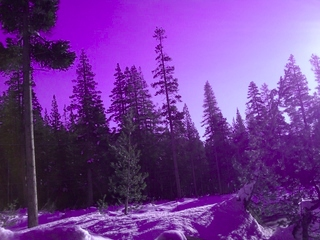

.. _chap-imagebufalgo:

ImageBufAlgo: Image Processing
##############################

ImageBufAlgo is a set of image processing functions that operate on
ImageBuf's. The functions are declared in the header file
:file:`OpenImageIO/imagebufalgo.h` and are declared in the
`namespace ImageBufAlgo`.

ImageBufAlgo common principles
==============================

.. .. doxygengroup: ImageBufAlgo_intro
   Do I like the above one better?

This section explains the general rules common to all ImageBufAlgo
functions. Only exceptions to these rules will be explained in the
subsequent listings of all the individual ImageBufAlgo functions.

Return values and error messages
^^^^^^^^^^^^^^^^^^^^^^^^^^^^^^^^

Most ImageBufAlgo functions that produce image data come in two forms:

1. Return an ImageBuf.

   The return value is a new ImageBuf containing the result image. In this
   case, an entirely new image will be created to hold the result. In case of
   error, the result image returned can have any error conditions checked with
   `has_error()` and `geterror()`.
   
   .. code-block:: cpp
   
       // Method 1: Return an image result
       ImageBuf fg ("fg.exr"), bg ("bg.exr");
       ImageBuf dst = ImageBufAlgo::over (fg, bg);
       if (dst.has_error())
           std::cout << "error: " << dst.geterror() << "\n";
   
   
2. Pass a destination ImageBuf reference as the first parameter.
   
   The function is passed a *destination* ImageBuf where the results will
   be stored, and the return value is a `bool` that is `true` if the
   function succeeds or `false` if the function fails. Upon failure, the
   destination ImageBuf (the one that is being altered) will have an error
   message set.
   
   .. code-block:: cpp
   
       // Method 2: Write into an existing image
       ImageBuf fg ("fg.exr"), bg ("bg.exr");
       ImageBuf dst;   // will be the output image
       bool ok = ImageBufAlgo::over (dst, fg, bg);
       if (! ok)
           std::cout << "error: " << dst.geterror() << "\n";
   

The first option (return an ImageBuf directly) is a more compact and
intuitive notation that is natural for most simple uses. But the second
option (pass an `ImageBuf&` referring to an existing destination) offers
additional flexibility, including more careful control over allocations, the
ability to partially overwrite regions of an existing image, and the ability
for the destination image to also be one of the input images (for example,
`add(A,A,B)` adds B into existing image A, with no third image allocated at
all).

For a small minority of ImageBufAlgo functions, there are only input images,
and no image outputs (e.g., `isMonochrome()`).  In such cases, the error
message should be retrieved from the first input image.

Region of interest
^^^^^^^^^^^^^^^^^^

Most ImageBufAlgo functions take an optional ROI parameter that restricts
the operation to a range in x, y, z, and channels. The default-constructed
ROI (also known as `ROI::All()`) means no region restriction -- the whole
image will be copied or altered.

For ImageBufAlgo functions that write into a destination ImageBuf parameter
and it is already initialized (i.e. allocated with a particular size and
data type), the operation will be performed on the pixels in the destination
that overlap the ROI, leaving pixels in the destination which are outside
the ROI unaltered.

For ImageBufAlgo functions that return an ImageBuf directly, or if their
`dst` parameter is an uninitialized ImageBuf, the ROI (if set) determines
the size of the result image. If the ROI is the default `All`, the result
image size will be the union of the pixel data windows of the input images
and have a data type determind by the data types of the input images.

Most ImageBufAlgo functions also respect the `chbegin` and `chend` members
of the ROI, thus restricting the channel range on which the operation is
performed.  The default ROI constructor sets up the ROI to specify that the
operation should be performed on all channels of the input image(s).

Constant and per-channel values
^^^^^^^^^^^^^^^^^^^^^^^^^^^^^^^

Many ImageBufAlgo functions take per-channel constant-valued arguments (for
example, a fill color). These parameters are passed as `cspan<float>`. These
are generally expected to have length equal to the number of channels. But
you may also pass a single float which will be used as the value for all
channels. (More generally, what is happening is that the last value supplied
is replicated for any missing channel.)

Some ImageBufAlgo functions have parameters of type `Image_or_Const`, which
may take either an ImageBuf reference, or a per-channel constant, or a
single constant to be used for all channels.

Multithreading
^^^^^^^^^^^^^^

All ImageBufAlgo functions take an optional `nthreads` parameter that
signifies the maximum number of threads to use to parallelize the
operation.  The default value for `nthreads` is 0, which signifies
that the number of thread should be the OIIO global default set by
`OIIO::attribute()` (see Section~\ref{sec:attribute:threads}), which
itself defaults to be the detected level of hardware concurrency (number
of cores available).

Generally you can ignore this parameter (or pass 0), meaning to use all
the cores available in order to perform the computation as quickly as
possible.  The main reason to explicitly pass a different number
(generally 1) is if the application is multithreaded at a high level,
and the thread calling the ImageBufAlgo function just wants to continue doing
the computation without spawning additional threads, which might tend to
crowd out the other application threads.

.. _sec-iba-patterns:

Pattern generation
==================

For the ImageBufAlgo functions in this section, there is no "source" image.
Therefore, either an initialized `dst` must be supplied (to give a pre-
allocated size and data type of the image), or else it is strictly necessary
to supply an ROI parameter to specify the size of the new image (the data
type in this case will always be `float`). It is an error if one of the
pattern generation ImageBufAlgo functions is neither supplied a
pre-allocated `dst` nor a non-default ROI.

zero() -- create a black image
^^^^^^^^^^^^^^^^^^^^^^^^^^^^^^^^^^^^^^^^^^^^

.. doxygenfunction:: zero(ROI, int)

..

  Examples::

    // Create a new 3-channel, 512x512 float image filled with 0.0 values.
    ImageBuf zero = ImageBufAlgo::zero (ROI(0,512,0,512,0,1,0,3));
    
    // Zero out an existing buffer, keeping it the same size and data type
    ImageBuf A = ...;
    ...
    ImageBufAlgo::zero (A);
    
    // Zero out a rectangular region of an existing buffer
    ImageBufAlgo::zero (A, ROI (0, 100, 0, 100));
    
    // Zero out just the green channel, leave everything else the same
    ROI roi = A.roi ();
    roi.chbegin = 1; // green
    roi.chend = 2;   // one past the end of the channel region
    ImageBufAlgo::zero (A, roi);

  Result-as-parameter version:

    .. doxygenfunction:: zero(ImageBuf&, ROI, int)

|

fill() -- fill a region with a solid color or gradient
^^^^^^^^^^^^^^^^^^^^^^^^^^^^^^^^^^^^^^^^^^^^^^^^^^^^^^^^^^^^^^^^^^^^

.. doxygengroup:: fill
..

  Examples::

    // Create a new 640x480 RGB image, with a top-to-bottom gradient
    // from red to pink
    float pink[3] = { 1, 0.7, 0.7 };
    float red[3] = { 1, 0, 0 };
    ImageBuf A = ImageBufAlgo::fill (red, pink, ROI(0, 640, 0, 480, 0, 1, 0, 3));

    // Draw a filled red rectangle overtop existing image A.
    ImageBufAlgo::fill (A, red, ROI(50,100, 75, 175));

  .. image:: figures/fill.jpg
        :align: center
        :width: 2.0 in

|

checker() -- make a checker pattern
^^^^^^^^^^^^^^^^^^^^^^^^^^^^^^^^^^^

.. doxygenfunction:: checker(int, int, int, cspan<float>, cspan<float>, int, int, int, ROI, int)
..

  Examples::

    // Create a new 640x480 RGB image, fill it with a two-toned gray
    // checkerboard, the checkers being 64x64 pixels each.
    ImageBuf A (ImageSpec(640, 480, 3, TypeDesc::FLOAT);
    float dark[3] = { 0.1, 0.1, 0.1 };
    float light[3] = { 0.4, 0.4, 0.4 };
    ImageBufAlgo::checker (A, 64, 64, 1, dark, light, 0, 0, 0);

  .. image:: figures/checker.jpg
        :align: center
        :width: 2.0in

  Result-as-parameter version:

    .. doxygenfunction:: checker(ImageBuf&, int, int, int, cspan<float>, cspan<float>, int, int, int, ROI, int)

|

noise() -- make a noise pattern
^^^^^^^^^^^^^^^^^^^^^^^^^^^^^^^

.. doxygenfunction:: noise(string_view, float, float, bool, int, ROI, int)
..

  Examples::

    // Create a new 256x256 field of grayscale uniformly distributed noise on [0,1)
    ImageBuf A = ImageBufAlgo::noise ("uniform", 0.0f /*min*/, 1.0f /*max*/,
                         true /*mono*/, 1 /*seed*/, ROI(0,256,0,256,0,1,0,3));

    // Add color Gaussian noise to an existing image
    ImageBuf B ("tahoe.jpg");
    ImageBufAlgo::noise (B, "gaussian", 0.0f /*mean*/, 0.1f /*stddev*/,
                         false /*mono*/, 1 /*seed*/);

    // Use salt and pepper noise to make occasional random dropouts
    ImageBuf C ("tahoe.jpg");
    ImageBufAlgo::noise (C, "salt", 0.0f /*value*/, 0.01f /*portion*/,
                         true /*mono*/, 1 /*seed*/);

  ..

  .. |noiseimg1| image:: figures/unifnoise1.jpg
     :height: 1.5 in
  .. |noiseimg2| image:: figures/tahoe-gauss.jpg
     :height: 1.5 in
  .. |noiseimg3| image:: figures/tahoe-pepper.jpg
     :height: 1.5 in

  ..

    +------------------------+------------------------+------------------------+
    | |noiseimg1|            | |noiseimg2|            | |noiseimg3|            |
    +------------------------+------------------------+------------------------+
    | uniform noise          | gaussian noise added   | salt & pepper dropouts |
    +------------------------+------------------------+------------------------+

  Result-as-parameter version:

    .. doxygenfunction:: noise(ImageBuf&, string_view, float, float, bool, int, ROI, int)

|

Drawing shapes: points, lines, boxes
^^^^^^^^^^^^^^^^^^^^^^^^^^^^^^^^^^^^

.. doxygenfunction:: render_point
..

  Examples::

    ImageBuf A (ImageSpec (640, 480, 4, TypeDesc::FLOAT));
    float red[4] = { 1, 0, 0, 1 };
    ImageBufAlgo::render_point (A, 50, 100, red);

|

.. doxygenfunction:: render_line
..

  Examples::

    ImageBuf A (ImageSpec (640, 480, 4, TypeDesc::FLOAT));
    float red[4] = { 1, 0, 0, 1 };
    ImageBufAlgo::render_line (A, 10, 60, 250, 20, red);
    ImageBufAlgo::render_line (A, 250, 20, 100, 190, red, true);

  .. image:: figures/lines.png
    :align: center
    :width: 2.0 in

|

.. doxygenfunction:: render_box
..

  Examples::

    ImageBuf A (ImageSpec (640, 480, 4, TypeDesc::FLOAT));
    float cyan[4] = { 1, 0, 0, 1 };
    ImageBufAlgo::render_box (A, 150, 100, 240, 180, cyan);
    float yellow_transparent[4] = { 0.5, 0.5, 0, 0.5 };
    ImageBufAlgo::render_box (A, 100, 50, 180, 140, yellow_transparent, true);

  .. image:: figures/box.png
    :align: center
    :width: 2.0 in

|

Drawing text
^^^^^^^^^^^^^^^^^^^^^^^^^^^^^^^^^^^^

.. doxygenfunction:: render_text(ImageBuf&, int, int, string_view, int, string_view, cspan<float>, TextAlignX, TextAlignY, int, ROI, int)
..

  Examples::

    ImageBufAlgo::render_text (ImgA, 50, 100, "Hello, world");

    float red[] = { 1, 0, 0, 1 };
    ImageBufAlgo::render_text (ImgA, 100, 200, "Go Big Red!",
                               60, "Arial Bold", red);

    float white[] = { 1, 1, 1, 1 };
    ImageBufAlgo::render_text (ImgB, 320, 240, "Centered",
                               60, "Arial Bold", white,
                               TextAlignX::Center, TextAlignY::Center);

.. |textimg1| image:: figures/text.jpg
   :width: 2.5 in
.. |textimg2| image:: figures/textcentered.jpg
   :width: 2.5 in
..

  +-----------------+-----------------+
  | |textimg1|      | |textimg2|      |
  +-----------------+-----------------+

|

.. doxygenfunction:: text_size
..

  Example::

    // Render text centered in the image, using text_size to find out
    // the size we will need and adjusting the coordinates.
    ImageBuf A (ImageSpec (640, 480, 4, TypeDesc::FLOAT));
    ROI Aroi = A.roi();
    ROI size = ImageBufAlgo::text_size ("Centered", 48, "Courier New");
    if (size.defined()) {
        int x = Aroi.xbegin + Aroi.width()/2  - (size.xbegin + size.width()/2);
        int y = Aroi.ybegin + Aroi.height()/2 - (size.ybegin + size.height()/2);
        ImageBufAlgo::render_text (A, x, y, "Centered", 48, "Courier New");
    }

.. _sec-iba-transforms:

Image transformations and data movement
=======================================

Shuffling channels
^^^^^^^^^^^^^^^^^^^^^^^^^^^^^^^^^^^^

.. doxygenfunction:: channels(const ImageBuf&, int, cspan<int>, cspan<float>, cspan<std::string>, bool, int)
..

  Examples::

    // Copy the first 3 channels of an RGBA, drop the alpha
    ImageBuf RGBA (...);   // assume it's initialized, 4 chans
    ImageBuf RGB = ImageBufAlgo::channels (RGBA, 3, {} /*default ordering*/);

    // Copy just the alpha channel, making a 1-channel image
    ImageBuf Alpha = ImageBufAlgo::channels (RGBA, 1, 3 /*alpha_channel*/);

    // Swap the R and B channels into an existing image
    ImageBuf BRGA;
    int channelorder[] = { 2 /*B*/, 1 /*G*/, 0 /*R*/, 3 /*A*/ };
    ImageBufAlgo::channels (BRGA, RGBA, 4, channelorder);

    // Add an alpha channel with value 1.0 everywhere to an RGB image,
    // keep the other channels with their old ordering, values, and
    // names.
    int channelorder[] = { 0, 1, 2, -1 /*use a float value*/ };
    float channelvalues[] = { 0 /*ignore*/, 0 /*ignore*/, 0 /*ignore*/, 1.0 };
    std::string channelnames[] = { "", "", "", "A" };
    ImageBuf RGBA = ImageBufAlgo::channels (RGB, 4, channelorder,
                                            channelvalues, channelnames);

    // Simple copying of channels from dst to src but fixing the number
    // of channels dropping those in excess, or adding 0.0-filled channels
    // if there is a shortfall)
    ImageBuf out = ImageBufAlgo::channels (RGBA, nchannels, {}, {}, {}, true);

  Result-as-parameter version:

    .. doxygenfunction:: channels(ImageBuf&, const ImageBuf&, int, cspan<int>, cspan<float>, cspan<std::string>, bool, int)

|

.. doxygenfunction:: channel_append(const ImageBuf&, const ImageBuf&, ROI, int)
..

  Examples::

    ImageBuf RGBA (...);   // assume initialized, 4 channels
    ImageBuf Z (...);      // assume initialized, 1 channel
    ImageBuf RGBAZ = ImageBufAlgo::channel_append (RGBA, Z);

  Result-as-parameter version:

    .. doxygenfunction:: channel_append(ImageBuf&, const ImageBuf&, const ImageBuf&, ROI, int)

|

.. doxygenfunction:: copy(const ImageBuf&, TypeDesc, ROI, int)
..

  Examples::

    // Set B to be A, but converted to float
    ImageBuf A (...);  // Assume initialized
    ImageBuf B = ImageBufAlgo::copy (A, TypeDesc::FLOAT);

  Result-as-parameter version:

    .. doxygenfunction:: copy(ImageBuf&, const ImageBuf&, TypeDesc, ROI, int)

|

.. doxygenfunction:: crop(const ImageBuf&, ROI, int)
..

  Examples::

    // Set B to be the upper left 200x100 region of A
    ImageBuf A (...);  // Assume initialized
    ImageBuf B = ImageBufAlgo::crop (A, ROI(0,200,0,100));

  Result-as-parameter version:

    .. doxygenfunction:: crop(ImageBuf&, const ImageBuf&, ROI, int)

|

.. doxygenfunction:: cut(const ImageBuf&, ROI, int)
..

  Examples::

    // Set B to be the 100x100 region of A with origin (50,200).
    ImageBuf A (...);  // Assume initialized
    ImageBuf B = ImageBufAlgo::cut (A, ROI(50,250,200,300));
    // Note: B will have origin 0,0, NOT (50,200).

  Result-as-parameter version:

    .. doxygenfunction:: cut(ImageBuf&, const ImageBuf&, ROI, int)

|

.. doxygenfunction:: paste
..

  Examples::

    // Paste small.exr on top of big.exr, offset by (100,100)
    ImageBuf Big ("big.exr");
    ImageBuf Small ("small.exr");
    ImageBufAlgo::paste (Big, 100, 100, 0, 0, Small);

.. doxygengroup:: rotateN
..

  Examples::

    ImageBuf A ("grid.jpg");
    ImageBuf R90 = ImageBufAlgo::rotate90 (A);
    ImageBuf R170 = ImageBufAlgo::rotate180 (A);
    ImageBuf R270 = ImageBufAlgo::rotate270 (A);

.. |rotimg1| image:: figures/grid-small.jpg
   :width: 1.5 in
.. |rotimg2| image:: figures/rotate90.jpg
   :width: 1.5 in

.. |rotimg4| image:: figures/rotate270.jpg
   :width: 1.5 in
..

  +-------------+-------------+-------------+-------------+
  | |rotimg1|   | |rotimg2|   | |rotimg3|   | |rotimg4|   |
  +-------------+-------------+-------------+-------------+
  | original    | rotated 90  | rotated 180 | rotated 270 |
  +-------------+-------------+-------------+-------------+

.. doxygengroup:: flip-flop-transpose
..

  Examples::

    ImageBuf A ("grid.jpg");
    ImageBuf B;
    B = ImageBufAlgo::flip (A);
    B = ImageBufAlgo::flop (A);
    B = ImageBufAlgo::transpose (A);

.. |flipimg1| image:: figures/grid-small.jpg
   :width: 1.5 in
.. |flipimg2| image:: figures/flip.jpg
   :width: 1.5 in
.. |flipimg3| image:: figures/flop.jpg
   :width: 1.5 in
.. |flipimg4| image:: figures/transpose.jpg
   :width: 1.5 in
..

  +-------------+-------------+-------------+-------------+
  | |flipimg1|  | |flipimg2|  | |flipimg3|  | |flipimg4|  |
  +-------------+-------------+-------------+-------------+
  | original    | flip        | flop        | transpose   |
  +-------------+-------------+-------------+-------------+

.. doxygenfunction:: reorient(const ImageBuf&, int)
..

  Examples::

    ImageBuf A ("tahoe.jpg");
    A = ImageBufAlgo::reorient (A);

  Result-as-parameter version:

    .. doxygenfunction:: reorient(ImageBuf&, const ImageBuf&, int)

|

.. doxygenfunction:: circular_shift(const ImageBuf&, int, int, int, ROI, int)
..

  Examples::

    ImageBuf A ("grid.jpg");
    ImageBuf B = ImageBufAlgo::circular_shift (A, 70, 30);

.. |cshiftimg1| image:: figures/grid-small.jpg
   :width: 2.0 in

..

  +-----------------+-----------------+
  | |cshiftimg1|    | |cshiftimg2|    |
  +-----------------+-----------------+

  Result-as-parameter version:

  .. doxygenfunction:: circular_shift(ImageBuf&, const ImageBuf&, int, int, int, ROI, int)
  ..

|

.. doxygengroup:: rotate
..

  Examples::

    ImageBuf Src ("tahoe.exr");
    ImageBuf Dst = ImageBufAlgo::rotate (Src, 45.0);

.. |rotateimg1| image:: figures/grid-small.jpg
   :width: 2.0 in
.. |rotateimg2| image:: figures/rotate45.jpg
   :width: 2.0 in
..

  +-----------------+-----------------+
  | |rotateimg1|    | |rotateimg2|    |
  +-----------------+-----------------+

|

.. doxygengroup:: resize
..

  Examples::

    // Resize the image to 640x480, using the default filter
    ImageBuf Src ("tahoe.exr");
    ROI roi (0, 640, 0, 480, 0, 1, /*chans:*/ 0, Src.nchannels());
    ImageBuf Dst = ImageBufAlgo::resize (Src, "", 0, roi);

|

.. doxygenfunction:: resample(const ImageBuf&, bool, ROI, int)
..

  Examples::

    // Resample quickly to 320x240, using the default filter
    ImageBuf Src ("tahoe.exr");
    ROI roi (0, 320, 0, 240, 0, 1, /*chans:*/ 0, Src.nchannels());
    ImageBuf Dst = ImageBufAlgo::resample (Src, false, roi);

  Result-as-parameter version:

  .. doxygenfunction:: resample(ImageBuf&, const ImageBuf&, bool, ROI, int)
  ..

|

.. doxygengroup:: fit
..

  Examples::

    // Resize to fit into a max of 640x480, preserving the aspect ratio
    ImageBuf Src ("tahoe.exr");
    ROI roi (0, 640, 0, 480, 0, 1, /*chans:*/ 0, Src.nchannels());
    ImageBuf Dst = ImageBufAlgo::fit (Src, "", 0, true, roi);

|

.. doxygengroup:: warp
..

  Examples::

    Imath::M33f M ( 0.7071068, 0.7071068, 0,
                   -0.7071068, 0.7071068, 0,
                   20,        -8.284271,  1);
    ImageBuf Src ("tahoe.exr");
    ImageBuf Dst = ImageBufAlgo::warp (dst, src, M, "lanczos3");

|

.. _sec-iba-arith:

Image arithmetic
================

.. doxygenfunction:: add(Image_or_Const, Image_or_Const, ROI, int)
..

  Examples::

    // Add images A and B, assign to Sum
    ImageBuf A ("a.exr");
    ImageBuf B ("b.exr");
    ImageBuf Sum = ImageBufAlgo::add (Sum, A, B);

    // Add 0.2 to channels 0-2 of A
    ImageBuf A ("a.exr");
    ROI roi = get_roi (A.spec());
    roi.chbegin = 0;  roi.chend = 3;
    ImageBuf Sum = ImageBufAlgo::add (Sum, A, 0.2f, roi);

  Result-as-parameter version:

    .. doxygenfunction:: add(ImageBuf&, Image_or_Const, Image_or_Const, ROI, int)

|

.. doxygenfunction:: sub(Image_or_Const, Image_or_Const, ROI, int)
..

  Examples::

    ImageBuf A ("a.exr");
    ImageBuf B ("b.exr");
    ImageBuf Diff = ImageBufAlgo::sub (A, B);

  Result-as-parameter version:

    .. doxygenfunction:: sub(ImageBuf&, Image_or_Const, Image_or_Const, ROI, int)

|

.. doxygenfunction:: absdiff(Image_or_Const, Image_or_Const, ROI, int)
..

  Examples::

    ImageBuf A ("a.exr");
    ImageBuf B ("b.exr");
    ImageBuf Diff = ImageBufAlgo::absdiff (A, B);

  Result-as-parameter version:

    .. doxygenfunction:: absdiff(ImageBuf&, Image_or_Const, Image_or_Const, ROI, int)

|

.. doxygenfunction:: abs(const ImageBuf&, ROI, int)
..

  Examples::

    ImageBuf A ("a.exr");
    ImageBuf Abs = ImageBufAlgo::abs (A);

  Result-as-parameter version:

    .. doxygenfunction:: abs(ImageBuf&, const ImageBuf&, ROI, int)

|

.. doxygenfunction:: mul(Image_or_Const, Image_or_Const, ROI, int)
..

  Examples::

    ImageBuf A ("a.exr");
    ImageBuf B ("b.exr");
    ImageBuf Product = ImageBufAlgo::mul (Product, A, B);

    // Reduce intensity of A's channels 0-2 by 50%
    ROI roi = get_roi (A.spec());
    roi.chbegin = 0;  roi.chend = 3;
    ImageBufAlgo::mul (A, A, 0.5f, roi);

  Result-as-parameter version:

    .. doxygenfunction:: mul(ImageBuf&, Image_or_Const, Image_or_Const, ROI, int)

|

.. doxygenfunction:: div(Image_or_Const, Image_or_Const, ROI, int)
..

  Examples::

    ImageBuf A ("a.exr");
    ImageBuf B ("b.exr");
    ImageBuf Result = ImageBufAlgo::div (Result, A, B);

    // Reduce intensity of A's channels 0-2 by 50%
    ROI roi = get_roi (A.spec());
    roi.chbegin = 0;  roi.chend = 3;
    ImageBufAlgo::div (A, A, 2.0f, roi);

  Result-as-parameter version:

    .. doxygenfunction:: div(ImageBuf&, Image_or_Const, Image_or_Const, ROI, int)

|

.. doxygenfunction:: mad(Image_or_Const, Image_or_Const, Image_or_Const, ROI, int)
..

  Examples::

    ImageBuf A ("a.exr");
    ImageBuf B ("b.exr");
    ImageBuf C ("c.exr");
    ImageBuf Result = ImageBufAlgo::mad (A, B, C);

    // Compute the "inverse" A, which is 1.0-A, as A*(-1) + 1
    // Do this in-place, and only for the first 3 channels (leave any
    // alpha channel, if present, as it is).
    ROI roi = get_roi (A.spec());
    roi.chbegin = 0;  roi.chend = 3;
    ImageBufAlgo::mad (A, A, -1.0, 1.0, roi);

  Result-as-parameter version:

    .. doxygenfunction:: mad(ImageBuf&, Image_or_Const, Image_or_Const, Image_or_Const, ROI, int)

|

.. doxygenfunction:: over(const ImageBuf&, const ImageBuf&, ROI, int)
..

  Examples::

    ImageBuf A ("fg.exr");
    ImageBuf B ("bg.exr");
    ImageBuf Composite = ImageBufAlgo::over (A, B);

  Result-as-parameter version:

    .. doxygenfunction:: over(ImageBuf&, const ImageBuf&, const ImageBuf&, ROI, int)

|

.. doxygenfunction:: zover(const ImageBuf&, const ImageBuf&, bool, ROI, int)
..

  Examples::

    ImageBuf A ("a.exr");
    ImageBuf B ("b.exr");
    ImageBuf Composite = ImageBufAlgo::zover (Composite, A, B);

  Result-as-parameter version:

    .. doxygenfunction:: zover(ImageBuf&, const ImageBuf&, const ImageBuf&, bool, ROI, int)

|

.. doxygenfunction:: invert(const ImageBuf&, ROI, int)
..

  Examples::

    ImageBuf A ("a.exr");
    ImageBuf Inverse = ImageBufAlgo::invert (Inverse, A);

    // In this example, we are careful to deal with alpha in an RGBA image.
    // First we copy A to Inverse, un-premultiply the color values by alpha,
    // invert just the color channels in-place, and then re-premultiply the
    // colors by alpha.
    roi = A.roi();
    roi.chend = 3;      // Restrict roi to only R,G,B
    ImageBuf Inverse = ImageBufAlgo::unpremult (A);
    ImageBufAlgo::invert (Inverse, Inverse, roi);
    ImageBufAlgo::premult (Inverse, Inverse);

  ..

    .. image:: figures/tahoe-small.jpg
        :width: 2.0 in
    .. image:: figures/invert.jpg
        :width: 2.0 in

  |

  Result-as-parameter version:

    .. doxygenfunction:: invert(ImageBuf&, const ImageBuf&, ROI, int)

|

.. doxygenfunction:: pow(const ImageBuf&, cspan<float>, ROI, int)
..

  Examples::

    // Gamma-correct by 2.2 channels 0-2 of the image, in-place
    ROI roi = get_roi (A.spec());
    roi.chbegin = 0;  roi.chend = 3;
    ImageBufAlgo::pow (A, A, 1.0f/2.2f, roi);

  Result-as-parameter version:

    .. doxygenfunction:: pow(ImageBuf&, const ImageBuf&, cspan<float>, ROI, int)

|

.. doxygenfunction:: channel_sum(const ImageBuf&, cspan<float>, ROI, int)
..

  Examples::

    // Compute luminance via a weighted sum of R,G,B
    // (assuming Rec709 primaries and a linear scale)
    float luma_weights[3] = { .2126, .7152, .0722, 0.0 };
    ImageBuf A ("a.exr");
    ImageBuf lum = ImageBufAlgo::channel_sum (A, luma_weights);

  Result-as-parameter version:

    .. doxygenfunction:: channel_sum(ImageBuf&, const ImageBuf&, cspan<float>, ROI, int)

|

.. doxygenfunction:: max(Image_or_Const, Image_or_Const, ROI, int)
.. doxygenfunction:: min(Image_or_Const, Image_or_Const, ROI, int)
..

  Examples::

    // min of images A and B, assign to MinMimage
    ImageBuf A ("a.exr");
    ImageBuf B ("b.exr");
    ImageBuf MinImage = ImageBufAlgo::min (Sum, A, B);

    // Squash negative values in A by taking max(A, 0.0) for channels 0-2 of A
    ImageBuf A ("a.exr");
    ROI roi = get_roi (A.spec());
    roi.chbegin = 0;  roi.chend = 3;
    ImageBuf Sum = ImageBufAlgo::max (Sum, A, 0.0f, roi);

  Result-as-parameter version:

    .. doxygenfunction:: max(ImageBuf&, Image_or_Const, Image_or_Const, ROI, int)
    .. doxygenfunction:: min(ImageBuf&, Image_or_Const, Image_or_Const, ROI, int)

|

.. doxygenfunction:: clamp(const ImageBuf&, cspan<float>, cspan<float>, bool, ROI, int)
..

  Examples::

    // Clamp image buffer A in-place to the [0,1] range for all pixels.
    ImageBufAlgo::clamp (A, A, 0.0f, 1.0f);

    // Just clamp alpha to [0,1] in-place
    ImageBufAlgo::clamp (A, A, -std::numeric_limits<float>::max(),
                         std::numeric_limits<float>::max(), true);

    // Clamp R & G to [0,0.5], leave other channels alone
    std::vector<float> min (A.nchannels(), -std::numeric_limits<float>::max());
    std::vector<float> max (A.nchannels(), std::numeric_limits<float>::max());
    min[0] = 0.0f;  max[0] = 0.5f;
    min[1] = 0.0f;  max[1] = 0.5f;
    ImageBufAlgo::clamp (A, A, &min[0], &max[0], false);

  Result-as-parameter version:

    .. doxygenfunction:: clamp(ImageBuf&, const ImageBuf&, cspan<float>, cspan<float>, bool, ROI, int)

|

.. doxygenfunction:: contrast_remap(const ImageBuf&, cspan<float>, cspan<float>, cspan<float>, cspan<float>, cspan<float>, cspan<float>, ROI, int)
..

  Examples::

    ImageBuf A ("tahoe.tif");

    // Simple linear remap that stretches input 0.1 to black, and input
    // 0.75 to white.
    ImageBuf linstretch = ImageBufAlgo::contrast_remap (A, 0.1f, 0.75f);

    // Remapping 0->1 and 1->0 inverts the colors of the image,
    // equivalent to ImageBufAlgo::invert().
    ImageBuf inverse = ImageBufAlgo::contrast_remap (A, 1.0f, 0.0f);

    // Use a sigmoid curve to add contrast but without any hard cutoffs.
    // Use a contrast parameter of 5.0.
    ImageBuf sigmoid = ImageBufAlgo::contrast_remap (a, 0.0f, 1.0f,
                                                     0.0f, 1.0f, 5.0f);

.. |crimage1| image:: figures/tahoe-small.jpg
   :width: 1.5 in
.. |crimage2| image:: figures/tahoe-lincontrast.jpg
   :width: 1.5 in
.. |crimage3| image:: figures/tahoe-inverse.jpg
   :width: 1.5 in
.. |crimage4| image:: figures/tahoe-sigmoid.jpg
   :width: 1.5 in
..

  +-------------+-------------+-------------+-------------+
  | |crimage1|  | |crimage2|  | |crimage3|  | |crimage4|  |
  +-------------+-------------+-------------+-------------+
  | original    | linstretch  | inverse     | sigmoid     |
  +-------------+-------------+-------------+-------------+

  Result-as-parameter version:

    .. doxygenfunction:: contrast_remap(ImageBuf&, const ImageBuf&, cspan<float>, cspan<float>, cspan<float>, cspan<float>, cspan<float>, cspan<float>, ROI, int)

|

.. doxygengroup:: color_map
..

  Examples::

    // Use luminance of a.exr (assuming Rec709 primaries and a linear
    // scale) and map to a spectrum-like palette.:
    ImageBuf A ("a.exr");
    ImageBuf B = ImageBufAlgo::color_map (A, -1, "turbo");

    float mymap[] = { 0.25, 0.25, 0.25,  0, 0.5, 0,  1, 0, 0 };
    B = ImageBufAlgo::color_map (A, -1 /* use luminance */,
                                 3 /* num knots */, 3 /* channels */,
                                 mymap);

.. |cmimage1| image:: figures/tahoe-small.jpg
   :width: 1.0 in
.. |cmimage2| image:: figures/colormap-inferno.jpg
   :width: 1.0 in

.. |cmimage4| image:: figures/colormap-turbo.jpg
   :width: 1.0 in

..

  +-----------------+-----------------+-----------------+-----------------+---------------+
  | |cmimage1|      | |cmimage2|      | |cmimage3|      | |cmimage4|      | |cmimage5|    |
  +-----------------+-----------------+-----------------+-----------------+---------------+
  | original        | inferno         | viridis         | turbo           | custom values |
  +-----------------+-----------------+-----------------+-----------------+---------------+

.. doxygengroup:: range
..

  Examples::

    // Resize the image to 640x480, using a Lanczos3 filter, which
    // has negative lobes. To prevent those negative lobes from
    // producing ringing or negative pixel values for HDR data,
    // do range compression, then resize, then re-expand the range.

    // 1. Read the original image
    ImageBuf Src ("tahoeHDR.exr");

    // 2. Range compress to a logarithmic scale
    ImageBuf Compressed = ImageBufAlgo::rangecompress (Src);

    // 3. Now do the resize
    ImageBuf Dst = ImageBufAlgo::resize (Comrpessed, "lanczos3", 6.0,
                                         ROI(0, 640, 0, 480));

    // 4. Expand range to be linear again (operate in-place)
    ImageBufAlgo::rangeexpand (Dst, Dst);

.. _sec-iba-stats:

Image comparison and statistics
===============================

.. doxygenfunction:: computePixelStats(const ImageBuf&, ROI, int)
..

  The PixelStats structure is defined as follows::

        struct PixelStats {
            std::vector<float> min;
            std::vector<float> max;
            std::vector<float> avg;
            std::vector<float> stddev;
            std::vector<imagesize_t> nancount;
            std::vector<imagesize_t> infcount;
            std::vector<imagesize_t> finitecount;
        };

  Examples::

    ImageBuf A ("a.exr");
    ImageBufAlgo::PixelStats stats;
    ImageBufAlgo::computePixelStats (stats, A);
    for (int c = 0;  c < A.nchannels();  ++c) {
        std::cout << "Channel " << c << ":\n";
        std::cout << "   min = " << stats.min[c] << "\n";
        std::cout << "   max = " << stats.max[c] << "\n";
        std::cout << "   average = " << stats.avg[c] << "\n";
        std::cout << "   standard deviation  = " << stats.stddev[c] << "\n";
        std::cout << "   # NaN values    = " << stats.nancount[c] << "\n";
        std::cout << "   # Inf values    = " << stats.infcount[c] << "\n";
        std::cout << "   # finite values = " << stats.finitecount[c] << "\n";
    }

|

.. doxygenfunction:: compare(const ImageBuf&, const ImageBuf&, float, float, ROI, int)
..

  The CompareResults structure is defined as follows::

        struct CompareResults {
            double meanerror, rms_error, PSNR, maxerror;
            int maxx, maxy, maxz, maxc;
            imagesize_t nwarn, nfail;
            bool error;
        };

  Examples::

    ImageBuf A ("a.exr");
    ImageBuf B ("b.exr");
    ImageBufAlgo::CompareResults comp;
    ImageBufAlgo::compare (A, B, 1.0f/255.0f, 0.0f, comp);
    if (comp.nwarn == 0 && comp.nfail == 0) {
        std::cout << "Images match within tolerance\n";
    } else {
        std::cout << "Image differed: " << comp.nfail << " failures, "
                  << comp.nwarn << " warnings.\n";
        std::cout << "Average error was " << comp.meanerror << "\n";
        std::cout << "RMS error was " << comp.rms_error << "\n";
        std::cout << "PSNR was " << comp.PSNR << "\n";
        std::cout << "largest error was " << comp.maxerror 
                  << " on pixel (" << comp.maxx << "," << comp.maxy 
                  << "," << comp.maxz << "), channel " << comp.maxc << "\n";
    }

|

.. doxygenfunction:: compare_Yee(const ImageBuf&, const ImageBuf&, CompareResults&, float, float, ROI, int)
..

|

.. doxygenfunction:: isConstantColor(const ImageBuf&, float, span<float>, ROI, int)
..

  Examples::

    ImageBuf A ("a.exr");
    std::vector<float> color (A.nchannels());
    if (ImageBufAlgo::isConstantColor (A, color)) {
        std::cout << "The image has the same value in all pixels: ";
        for (int c = 0;  c < A.nchannels();  ++c)
            std::cout << (c ? " " : "") << color[c];
        std::cout << "\n";
    } else {
        std::cout << "The image is not a solid color.\n";
    }

|

.. doxygenfunction:: isConstantChannel(const ImageBuf&, int, float, float, ROI, int)
..

  Examples::

    ImageBuf A ("a.exr");
    int alpha = A.spec().alpha_channel;
    if (alpha < 0)
        std::cout << "The image does not have an alpha channel\n";
    else if (ImageBufAlgo::isConstantChannel (A, alpha, 1.0f))
        std::cout << "The image has alpha = 1.0 everywhere\n";
    else
        std::cout << "The image has alpha < 1 in at least one pixel\n";

|

.. doxygenfunction:: isMonochrome(const ImageBuf&, float, ROI, int)
..

  Examples::

    ImageBuf A ("a.exr");
    ROI roi = get_roi (A.spec());
    roi.chend = std::min (3, roi.chend);  // only test RGB, not alpha
    if (ImageBufAlgo::isMonochrome (A, roi))
        std::cout << "a.exr is really grayscale\n";

|

.. doxygenfunction:: color_count(const ImageBuf&, imagesize_t*, int, cspan<float>, cspan<float>, ROI, int)
..

  Examples::

    ImageBuf A ("a.exr");
    int n = A.nchannels();

    // Try to match two colors: pure red and green
    std::vector<float> colors (2*n, numeric_limits<float>::max());
    colors[0] = 1.0f; colors[1] = 0.0f; colors[2] = 0.0f;
    colors[n+0] = 0.0f; colors[n+1] = 1.0f; colors[n+2] = 0.0f;

    const int ncolors = 2;
    imagesize_t count[ncolors];
    ImageBufAlgo::color_count (A, count, ncolors);
    std::cout << "Number of red pixels   : " << count[0] << "\n";
    std::cout << "Number of green pixels : " << count[1] << "\n";

|

.. doxygenfunction:: color_range_check(const ImageBuf&, imagesize_t*, imagesize_t*, imagesize_t*, cspan<float>, cspan<float>, ROI, int)
..

  Examples::

    ImageBuf A ("a.exr");
    ROI roi = get_roi (A.spec());
    roi.chend = std::min (roi.chend, 4);  // only compare RGBA

    float low[] = {0, 0, 0, 0};
    float high[] = {1, 1, 1, 1};

    imagesize_t lowcount, highcount, inrangecount;
    ImageBufAlgo::color_range_check (A, &lowcount, &highcount, &inrangecount,
                                     low, high, roi);
    std::cout << lowcount << " pixels had components < 0\n";
    std::cout << highcount << " pixels had components > 1\n";
    std::cout << inrangecount << " pixels were fully within [0,1] range\n";

|

.. doxygenfunction:: nonzero_region
..

  Examples::

    ImageBuf A ("a.exr");
    ROI shrunk = ImageBufAlgo::nonzero_region (A);
    if (shrunk.undefined())
        std::cout << "All pixels were empty\n";
    else
        std::cout << "Non-empty region was " << shrunk << "\n";

|

.. doxygenfunction:: computePixelHashSHA1
..

  Examples::

    ImageBuf A ("a.exr");
    std::string hash;
    hash = ImageBufAlgo::computePixelHashSHA1 (A, "", ROI::All(), 64);

|

.. doxygenfunction:: histogram(const ImageBuf&, int, int, float, float, bool, ROI, int)
..

  Examples::

    ImageBuf Src ("tahoe.exr");
    const int bins = 4;
    std::vector<imagesize_t> hist =
        ImageBufAlgo::histogram (Src, 0, bins, 0.0f, 1.0f);
    std::cout << "Channel 0 of the image had:\n";
    float binsize = (max-min)/nbins;
    for (int i = 0;  i < nbins;  ++i)
        hist[i] << " pixels that are >= " << (min+i*binsize) << " and "
                << (i == nbins-1 ? " <= " : " < ")
                << (min+(i+1)*binsize) << "\n";

.. _sec-iba-convolutions:

Convolutions and frequency-space algorithms
===========================================

.. doxygenfunction:: make_kernel(string_view, float, float, float, bool)
..

  Examples::

    ImageBuf K = ImageBufAlgo::make_kernel ("gaussian", 5.0f, 5.0f);

|

.. doxygenfunction:: convolve(const ImageBuf&, const ImageBuf&, bool, ROI, int)
..

  Examples::

    // Blur an image with a 5x5 Gaussian kernel
    ImageBuf Src ("tahoe.exr");
    ImageBuf K = ImageBufAlgo::make_kernel ("gaussian", 5.0f, 5.0f);
    ImageBuf Blurred = ImageBufAlgo::convolve (Src, K);

.. |convimage1| image:: figures/tahoe-small.jpg
   :width: 2.0 in
.. |convimage2| image:: figures/tahoe-blur.jpg
   :width: 2.0 in
..

  +-----------------+-----------------+
  | |convimage1|    | |convimage2|    |
  +-----------------+-----------------+
  | original        | blurred         |
  +-----------------+-----------------+

  Result-as-parameter version:

    .. doxygenfunction:: convolve(ImageBuf&, const ImageBuf&, const ImageBuf&, bool, ROI, int)

|

.. doxygenfunction:: laplacian(const ImageBuf&, ROI, int)
..

  Examples::

    ImageBuf src ("tahoe.exr");
    ImageBuf lap = ImageBufAlgo::laplacian (src);

.. |lapimage1| image:: figures/tahoe-small.jpg
   :width: 2.0 in

..

  +-----------------+-----------------+
  | |lapimage1|     | |lapimage2|     |
  +-----------------+-----------------+
  | original        | Laplacian image |
  +-----------------+-----------------+

  .. doxygenfunction:: laplacian(ImageBuf&, const ImageBuf&, ROI, int)

|

.. doxygengroup:: fft-ifft
..

  Examples::

    ImageBuf Src ("tahoe.exr");

    // Take the DFT of the first channel of Src
    ImageBuf Freq = ImageBufAlgo::fft (Src);

    // At this point, Freq is a 2-channel float image (real, imag)
    // Convert it back from frequency domain to a spatial image
    ImageBuf Spatial = ImageBufAlgo::ifft (Freq);

|

.. doxygengroup:: complex-polar
..

  Examples::

    // Suppose we have a set of frequency space values expressed as
    // amplitudes and phase...
    ImageBuf Polar ("polar.exr");

    // Convert to complex representation
    ImageBuf Complex = ImageBufAlgo::complex_to_polar (Polar);

    // Now, it's safe to take an IFFT of the complex image.
    // Convert it back from frequency domain to a spatial image.
    ImageBuf Spatial = ImageBufAlgo::ifft (Complex);

|

.. _sec-iba-enhance:

Image Enhancement / Restoration
===============================

.. doxygenfunction:: fixNonFinite(const ImageBuf&, NonFiniteFixMode, int*, ROI, int)
..

  Examples::

    ImageBuf Src ("tahoe.exr");
    int pixelsFixed = 0;
    ImageBufAlgo::fixNonFinite (Src, Src, ImageBufAlgo::NONFINITE_BOX3,
                                &pixelsFixed);
    std::cout << "Repaired " << pixelsFixed << " non-finite pixels\n";

  Result-as-parameter version:
    .. doxygenfunction:: fixNonFinite(ImageBuf&, const ImageBuf&, NonFiniteFixMode, int*, ROI, int)

|

.. doxygenfunction:: fillholes_pushpull(const ImageBuf&, ROI, int)
..

  Examples::

    ImageBuf Src ("holes.exr");
    ImageBuf Filled = ImageBufAlgo::fillholes_pushpull (Src);

  Result-as-parameter version:
    .. doxygenfunction:: fillholes_pushpull(ImageBuf&, const ImageBuf&, ROI, int)

|

.. doxygenfunction:: median_filter(ImageBuf&, const ImageBuf&, int, int, ROI, int)
..

  Examples::

    ImageBuf Noisy ("tahoe.exr");
    ImageBuf Clean = ImageBufAlgo::median_filter (Noisy, 3, 3);

..

.. |medimage1| image:: figures/tahoe-small.jpg
   :width: 2.0 in

.. |medimage3| image:: figures/tahoe-pepper-median.jpg
   :width: 2.0 in
..

  +-----------------+-----------------+-----------------+
  | |medimage1|     | |medimage2|     | |medimage3|     |
  +-----------------+-----------------+-----------------+
  | original        | with dropouts   | median filtered |
  +-----------------+-----------------+-----------------+

  Result-as-parameter version:
    .. doxygenfunction:: median_filter(ImageBuf&, const ImageBuf&, int, int, ROI, int)

|

.. doxygenfunction:: unsharp_mask(const ImageBuf&, string_view, float, float, float, ROI, int)
..

  Examples::

    ImageBuf Blurry ("tahoe.exr");
    ImageBuf Sharp = ImageBufAlgo::unsharp_mask (Blurry, "gaussian", 5.0f);

  Result-as-parameter version:
    .. doxygenfunction:: unsharp_mask(ImageBuf&, const ImageBuf&, string_view, float, float, float, ROI, int)

|

Morphological filters
=====================

.. doxygenfunction:: dilate(const ImageBuf&, int, int, ROI, int)
..

  Result-as-parameter version:
    .. doxygenfunction:: dilate(ImageBuf&, const ImageBuf&, int, int, ROI, int)

|

.. doxygenfunction:: erode(const ImageBuf&, int, int, ROI, int)
..

  Result-as-parameter version:
    .. doxygenfunction:: erode(ImageBuf&, const ImageBuf&, int, int, ROI, int)

|

Dilation and erosion are basic morphological filters, and more complex ones
are often constructed from them:

* "open" is erode followed by dilate, and it keeps the overall shape while
  removing small bright regions;
* "close" is dilate followed by erode, and it keeps the overall shape while
  removing small dark regions;
* "morphological gradient" is dilate minus erode, which gives a bright
  perimeter edge;
* "tophat" is the original source minus the "open", which isolates local
  peaks;
* "bottomhat" is the "close" minus the original source, which isolates dark
  holes.

Examples::

    ImageBuf Source ("source.tif");

    ImageBuf Dilated = ImageBufAlgo::dilate (Source, 3, 3);
    ImageBuf Eroded  = ImageBufAlgo::erode (Source, 3, 3);

    // Morphological "open" is dilate(erode((source))
    ImageBuf Opened = ImageBufAlgo::dilate (Eroded, 3, 3);
    // Morphological "close" is erode(dilate(source))
    ImageBuf Closed = ImageBufAlgo::erode (Dilated, 3, 3);
    // Morphological "gradient" is dilate minus erode
    ImageBuf Gradient = ImageBufAlgo::sub (Dilated, Eroded);
    // Tophat filter is source minus open
    ImageBuf Tophat = ImageBufAlgo::sub (Source, Opened);
    // Bottomhat filter is close minus source
    ImageBuf Bottomhat = ImageBufAlgo::sub (Close, Source);

.. |morph2| image:: figures/dilate.jpg
   :width: 1.0 in

.. |morph6| image:: figures/morphgradient.jpg
   :width: 1.0 in
.. |morph7| image:: figures/tophat.jpg
   :width: 1.0 in

..

  +-----------------+-----------------+-----------------+-----------------+
  | |morph1|        | |morph2|        | |morph3|        | |morph4|        |
  +-----------------+-----------------+-----------------+-----------------+
  | original        | dilate          | erode           | open            |
  +-----------------+-----------------+-----------------+-----------------+
  |                 |                 |                 |                 |
  | |morph5|        | |morph6|        | |morph7|        | |morph8|        |
  +-----------------+-----------------+-----------------+-----------------+
  | close           | gradient        | tophat          | bottomhat       |
  +-----------------+-----------------+-----------------+-----------------+

|

.. _sec-iba-color:

Color space conversion
======================

.. doxygengroup:: colorconvert
..

  Examples::

    #include <OpenImageIO/imagebufalgo.h>
    #include <OpenImageIO/color.h>
    using namespace OIIO;

    ImageBuf Src ("tahoe.jpg");
    ColorConfig cc;
    ColorProcessor *processor = cc.createColorProcessor ("vd8", "lnf");
    ImageBuf dst = ImageBufAlgo::colorconvert (Src, processor, true);
    ColorProcessor::deleteColorProcessor (processor);

    // Equivalent, though possibly less efficient if you will be
    // converting many images using the same transformation:
    ImageBuf Src ("tahoe.jpg");
    ImageBuf Dst = ImageBufAlgo::colorconvert (Src, "vd8", "lnf", true);

|

.. doxygenfunction:: colormatrixtransform(const ImageBuf&, const Imath::M44f&, bool, ROI, int)
..

  Examples::

    ImageBuf Src ("tahoe.jpg");
    Imath::M44f M ( .8047379,  .5058794, -.3106172, 0,
                   -.3106172,  .8047379,  .5058794, 0,
                    .5058794, -.3106172,  .8047379, 0,
                     0,         0,         0,       1);
    ImageBuf dst = ImageBufAlgo::colormatrixtransform (Src, M);

.. |ccmat1| image:: figures/tahoe-small.jpg
   :width: 1.5 in

..

  +-----------------+-----------------+
  | |ccmat1|        | |ccmat2|        |
  +-----------------+-----------------+
  | original        | matrix applied  |
  +-----------------+-----------------+

  Result-as-parameter version:
    .. doxygenfunction:: colormatrixtransform(ImageBuf&, const ImageBuf&, const Imath::M44f&, bool, ROI, int)

|

.. doxygenfunction:: ociolook(const ImageBuf&, string_view, string_view, string_view, bool, bool, string_view, string_view, ColorConfig*, ROI, int)
..

  Examples::

    ImageBuf Src ("tahoe.jpg");
    ImageBuf Dst = ImageBufAlgo::ociolook (Src, "look", "vd8", "lnf",
                                           true, false, "SHOT", "pe0012");

  Result-as-parameter version:
    .. doxygenfunction:: ociolook(ImageBuf&, const ImageBuf&, string_view, string_view, string_view, bool, bool, string_view, string_view, ColorConfig*, ROI, int)

|

.. doxygenfunction:: ociodisplay(const ImageBuf&, string_view, string_view, string_view, string_view, bool, string_view, string_view, ColorConfig*, ROI, int)
..

  Examples::

    ImageBuf Src ("tahoe.exr");
    ImageBuf Dst = ImageBufAlgo::ociodisplay (Src, "sRGB", "Film", "lnf",
                                              "", true, "SHOT", "pe0012");

  Result-as-parameter version:
    .. doxygenfunction:: ociodisplay(ImageBuf&, const ImageBuf&, string_view, string_view, string_view, string_view, bool, string_view, string_view, ColorConfig*, ROI, int)

|

.. doxygenfunction:: ociofiletransform(const ImageBuf&, string_view, bool, bool, ColorConfig*, ROI, int)
..

  Examples::

    ImageBuf Src ("tahoe.jpg");
    ImageBuf Dst = ImageBufAlgo::ociofiletransform (Src, "footransform.csp");

  Result-as-parameter version:
    .. doxygenfunction:: ociofiletransform(ImageBuf&, const ImageBuf&, string_view, bool, bool, ColorConfig*, ROI, int)

|

.. doxygengroup:: premult
..

  Examples::

    // Convert from unassociated alpha to associated alpha by
    // straightforward multiplication of color by alpha.
    ImageBuf Unassoc;  // Assume somehow this has unassociated alpha
    ImageBuf Assoc = ImageBufAlgo::premult (Unassoc);

    // Convert in-place from associated alpha to unassociated alpha,
    // preserving the color of alpha==0 pixels.
    ImageBuf A;
    ImageBufAlgo::unpremult (A, A);

    // Finish the round-trip back to associated, still preserving the
    // color of alpha==0 pixels. This should result in exactly the same
    // pixel values we started with (within precision limits).
    ImageBufAlgo::repremult (A, A);

.. _sec-iba-importexport:

Import / export
===============

.. doxygengroup:: make_texture
..

  Examples::

    // This command line:
    //    maketx in.exr --hicomp --filter lanczos3 --opaque-detect \
    //             -o texture.exr
    // is equivalent to:

    ImageBuf Input ("in.exr");
    ImageSpec config;
    config.attribute ("maketx:highlightcomp", 1);
    config.attribute ("maketx:filtername", "lanczos3");
    config.attribute ("maketx:opaque_detect", 1);
    stringstream s;
    bool ok = ImageBufAlgo::make_texture (ImageBufAlgo::MakeTxTexture,
                                          Input, "texture.exr", config, &s);
    if (! ok)
        std::cout << "make_texture error: " << s.str() << "\n";

|

OpenCV interoperability is performed by the `from_OpenCV()` and
`to_OpenCV()` functions:

.. doxygenfunction:: from_OpenCV
.. doxygenfunction:: to_OpenCV

.. doxygenfunction:: capture_image(int, TypeDesc)
..

  Examples::

    ImageBuf WebcamImage = ImageBufAlgo::capture_image (0, TypeDesc::UINT8);
    WebcamImage.write ("webcam.jpg");

.. _sec-iba-deep:

Deep images
===========

A number of ImageBufAlgo functions are designed to work with "deep" images.
These are detailed below. In general, ImageBufAlgo functions not listed in
this section should not be expected to work with deep images.

Functions specific to deep images
^^^^^^^^^^^^^^^^^^^^^^^^^^^^^^^^^

|

.. doxygenfunction:: deepen(const ImageBuf&, float, ROI, int)
..

  Examples::

    ImageBuf Flat ("RGBAZ.exr");
    ImageBuf Deep = ImageBufAlgo::deepen (Flat);

  Result-as-parameter version:
    .. doxygenfunction:: deepen(ImageBuf&, const ImageBuf&, float, ROI, int)

|

.. doxygenfunction:: flatten(const ImageBuf&, ROI, int)
..

  Examples::

    ImageBuf Deep ("deepalpha.exr");
    ImageBuf Flat = ImageBufAlgo::flatten (Deep);

  Result-as-parameter version:
    .. doxygenfunction:: flatten(ImageBuf&, const ImageBuf&, ROI, int)

|

.. doxygenfunction:: deep_merge(const ImageBuf&, const ImageBuf&, bool, ROI, int)
..

  Examples::

    ImageBuf DeepA ("hardsurf.exr");
    ImageBuf DeepB ("volume.exr");
    ImageBuf Merged = ImageBufAlgo::deep_merge (DeepA, DeepB);

  Result-as-parameter version:
    .. doxygenfunction:: deep_merge(ImageBuf&, const ImageBuf&, const ImageBuf&, bool, ROI, int)

|

.. doxygenfunction:: deep_holdout(const ImageBuf&, const ImageBuf&, ROI, int)
..

  Examples::

    ImageBuf Src ("image.exr");
    ImageBuf Holdout ("holdout.exr");
    ImageBuf Merged = ImageBufAlgo::deep_holdout (Src, Holdout);

  Result-as-parameter version:
    .. doxygenfunction:: deep_holdout(ImageBuf&, const ImageBuf&, const ImageBuf&, ROI, int)

|

General functions that also work for deep images
^^^^^^^^^^^^^^^^^^^^^^^^^^^^^^^^^^^^^^^^^^^^^^^^

.. cpp:function:: ImageBuf channels (const ImageBuf &src, int nchannels, cspan<int> channelorder,  cspan<float> channelvalues=NULL, cspan<std::string> newchannelnames={}, bool shuffle_channel_names=false)
                  bool channels (ImageBuf &dst, const ImageBuf &src, int nchannels, cspan<int> channelorder,  cspan<float> channelvalues=NULL, cspan<std::string> newchannelnames={}, bool shuffle_channel_names=false)

    Reorder, rename, remove, or add channels to a deep image.

.. cpp:function:: bool compare (const ImageBuf &A, const ImageBuf &B, float failthresh, float warnthresh, CompareResults &result, ROI roi={}, int nthreads=0)

    Numerically compare two images.

.. cpp:function:: bool computePixelStats (PixelStats &stats, const ImageBuf &src, ROI roi={}, int nthreads=0)

    Compute per-channel statistics about the image.

.. cpp:function:: ImageBuf crop (const ImageBuf &src, ROI roi={}, int nthreads=0)
                  bool crop (ImageBuf &dst, const ImageBuf &src, ROI roi={}, int nthreads=0)

    Crop the specified region of `src`, discarding samples outside the ROI.

.. cpp:function:: ROI nonzero_region (const ImageBuf &src, ROI roi={}, int nthreads=0)

    For "deep" images, this function returns the smallest ROI that contains
    all pixels that contain depth samples, and excludes the border pixels
    that contain no depth samples at all.

.. cpp:function:: ImageBuf add (const ImageBuf &A, cspan<float> B, ROI roi={}, int nthreads=0)
                  bool add (ImageBuf &dst, const ImageBuf &A, cspan<float> B, ROI roi={}, int nthreads=0)
.. cpp:function:: ImageBuf sub (const ImageBuf &A, cspan<float> B, ROI roi={}, int nthreads=0)
                  bool sub (ImageBuf &dst, const ImageBuf &A, cspan<float> B, ROI roi={}, int nthreads=0)
.. cpp:function:: ImageBuf mul (const ImageBuf &A, cspan<float> B, ROI roi={}, int nthreads=0)
                  bool mul (ImageBuf &dst, const ImageBuf &A, cspan<float> B, ROI roi={}, int nthreads=0)
.. cpp:function:: ImageBuf div (const ImageBuf &A, cspan<float> B, ROI roi={}, int nthreads=0)
                  bool div (ImageBuf &dst, const ImageBuf &A, cspan<float> B, ROI roi={}, int nthreads=0)

    Add, subtract, multiply, or divide all the samples in a deep image `A`
    by per-channel values `B[]`.

.. cpp:function:: ImageBuf fixNonFinite (const ImageBuf &src, NonFiniteFixMode mode = NONFINITE_BOX3, int *pixelsFixed = nullptr, ROI roi={}, int nthreads=0)
                  bool fixNonFinite (ImageBuf &dst, const ImageBuf &src, NonFiniteFixMode mode = NONFINITE_BOX3, int *pixelsFixed = nullptr, ROI roi={}, int nthreads=0)

    Repair nonfinite (`NaN` or `Inf`) values, setting them to 0.0.

.. cpp:function:: ImageBuf resample (const ImageBuf &src, bool interpolate = true, ROI roi={}, int nthreads=0)
                  bool resample (ImageBuf &dst, const ImageBuf &src, bool interpolate = true, ROI roi={}, int nthreads=0)

    Compute a resized version of the corresponding portion of `src` (mapping
    such that the "full" image window of each correspond to each other,
    regardless of resolution), for each pixel merely copying the closest
    deep pixel of the source image (no true interpolation is done for deep
    images).

