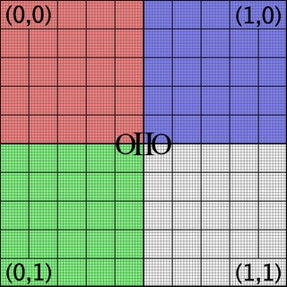
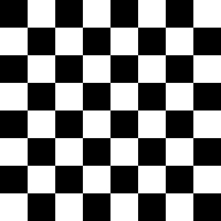
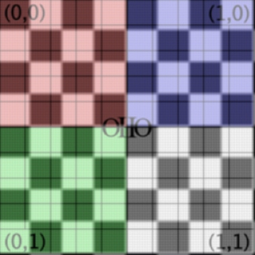
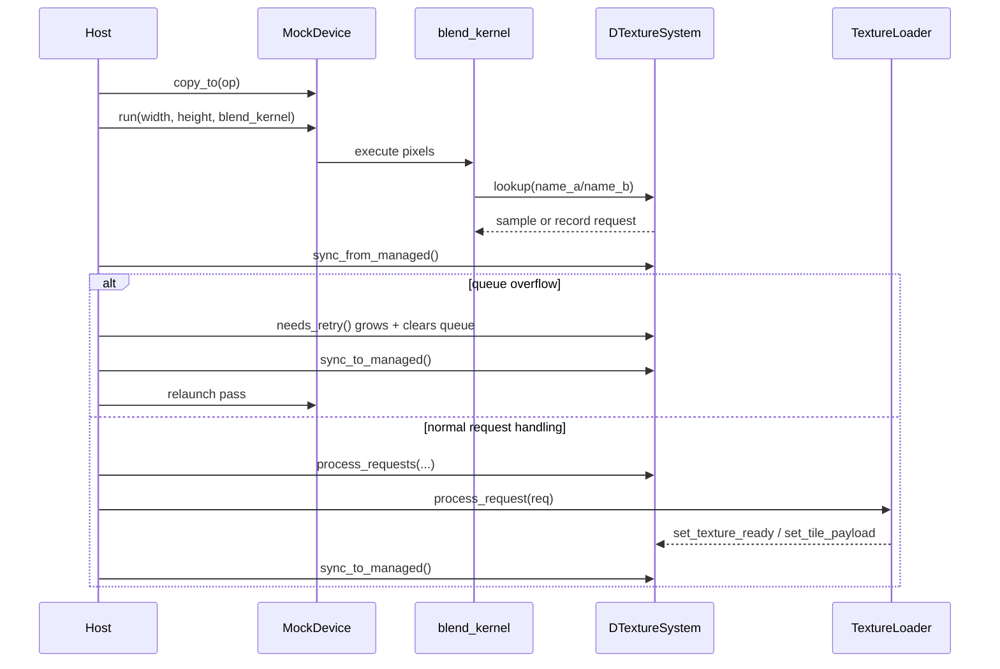
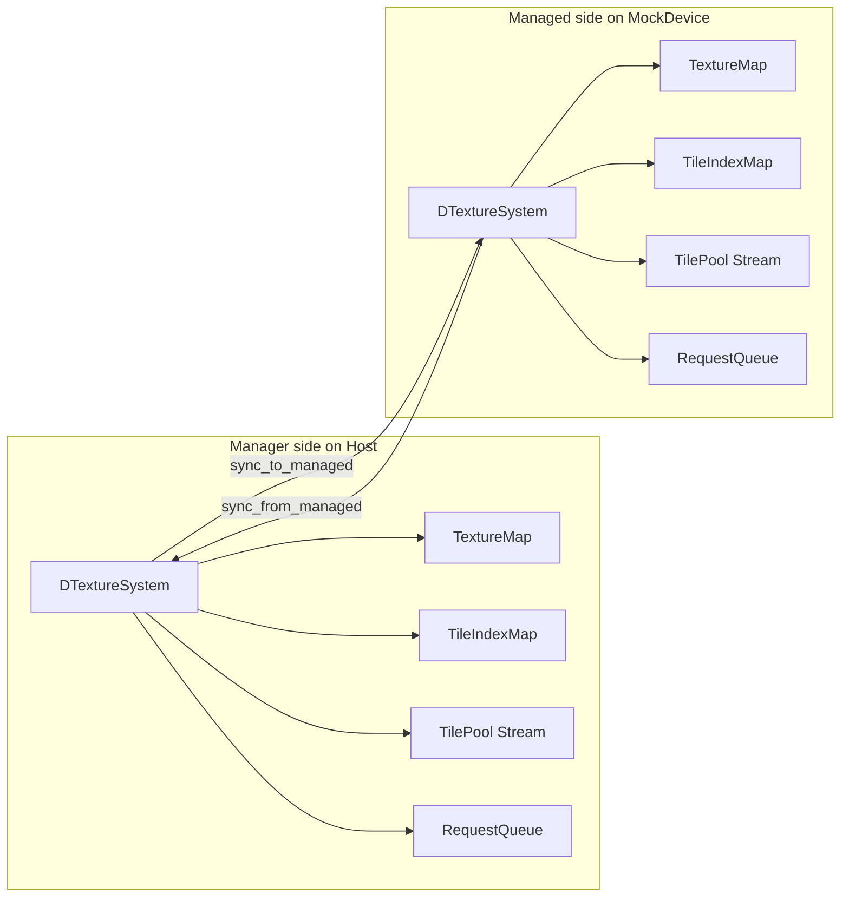
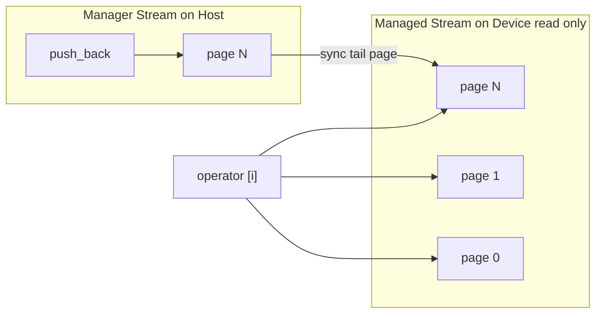
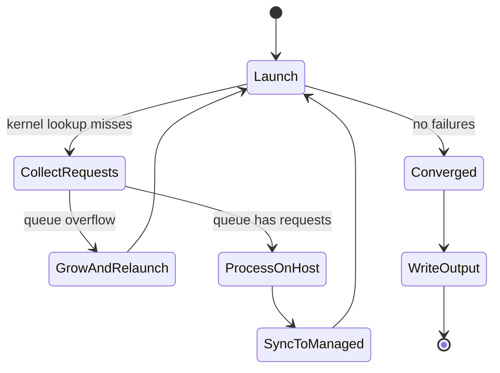

# A GPU texture system for a mock-up device

This directory contains a prototype texture system for code that must be safe in a
GPU-like kernel environment. The "device" in this test is a mock implementation,
but the code is structured as if host and device memory were separate, with
explicit copies between them. The demo operation is a simple blend + blur of two
input images:

| Input A | Input B | Operation on device | Result |
|---------|---------|---------------------|--------|
|  |  | blur + blend |  |

The goal is to validate a manager/managed architecture for texture lookup,
missing-resource requests, and retry-based execution. The host launches a kernel,
the kernel records missing textures or tiles, and the host resolves those requests
and relaunches until all required data is resident.

The test is intentionally scalar and pragmatic. It prioritizes architecture,
correctness, and integration points over peak performance.

The executable supports two memory modes:

- non-unified (default): host and device allocations are distinct and explicit
	copies are required.
- unified (`--unified`): host and device may share the same underlying pointer,
	while keeping the same manager/managed synchronization flow.

# The Arena and tagged_ptr framework

`Host` and `MockDevice` are the concrete arenas; both implement `alloc/free`,
`copy_to/copy_from`, and `copy_in`. `Host` tracks allocations and validates frees;
`MockDevice` does the same and also implements `run()` for kernel dispatch.

`tagged_ptr<T>` carries a lightweight context tag with every pointer. Dereference
checks the tag against the active execution context and aborts on mismatch —
catching accidental cross-boundary access without runtime overhead.

## Unified memory policy in this prototype

Unified mode is controlled by `NullArena::use_unified_memory`.

- Allocation order for mirrored data is device first, then host with `mirror`.
- In unified mode, host `alloc(mirror, ...)` returns `mirror` and does not
	allocate another block.
- Host `free()` treats mirrored unified pointers as externally owned, so the
	device-side owner frees once.
- Direction checks in `copy_to/copy_from/copy_in` still validate host vs device
	intent, but accept unified-tagged pointers.

## Optional CUDA arena sketch

`arena.h`/`arena.cpp` include a guidance-only `CudaArena`.

- Active only when CUDA headers are present (`TEXTURE_DEVICE_HAS_CUDA_RUNTIME`).
- Live CUDA calls require explicit opt-in (`TEXTURE_DEVICE_ENABLE_CUDA_SKETCH_IMPL=1`).
- `Atomic<T>` wraps CUDA atomics under `__CUDA_ARCH__`, and `std::atomic` on host.

The runtime still uses `MockDevice`; `CudaArena` is a future integration sketch.

# The main loop

The launch model is fail-and-retry:

```cpp
// copy_to/copy_from take tagged_ptr<[const] void> with explicit memory tags.
for (int pass = 0; pass < max_passes; ++pass) {
	textures.begin_launch();
	device.copy_to(device_op, tagged_ptr<const void>(&op, Host::mem_tag()),
	               sizeof(op));
	device.run(width, height, &blend_kernel, device_op);
	device.copy_from(tagged_ptr<void>(&op, Host::mem_tag()), device_op,
	                 sizeof(op));

	textures.sync_from_managed();

	if (textures.needs_retry()) {
		textures.sync_to_managed();
		continue;  // queue overflow path: recollect requests
	}

	if (!textures.failures())
		break;  // converged: all resources resident

	textures.process_requests([&](const Request& req,
	                             DTextureSystem<Host, MockDevice>* ts) {
		return loader.process_request(req, ts);
	});
	textures.sync_to_managed();
}
```

## Pass sequence at a glance



## Our example blend kernel

```cpp
void blend_kernel(int x, int y, tagged_ptr<void> data)
{
	tagged_ptr<BlendOp> op(data);
	const float resx = static_cast<float>(op->width);
	const float resy = static_cast<float>(op->height);
	const float invx = 1.0f / resx;
	const float invy = 1.0f / resy;
	const float u    = (static_cast<float>(x) + 0.5f) * invx;
	const float v    = (static_cast<float>(y) + 0.5f) * invy;

	Vec2 duA { invx, 0.0f };
	Vec2 dvA { 0.0f, invy };
	Vec2 duB = 4.0f * duA;
	Vec2 dvB = 4.0f * dvA;

	RGBA A = op->texture_system.lookup(op->name_a, u, v, duA, dvA);
	RGBA B = op->texture_system.lookup(op->name_b, u, v, duB, dvB);

	if (op->texture_system.failures())
		return;

	op->output_buffer[y * op->width + x] = 0.5f * A + 0.5f * B;
}
```

# The manager/managed data container pattern

The core type is DTextureSystem<Arena, ManagedArena>.

- Managed form (device view): DTextureSystem<MockDevice>
- Manager form (host orchestration): DTextureSystem<Host, MockDevice>

Below is a sketch of how the managed mirror is constructed, synced, and transferred to the device:
```cpp
    Host host;
    MockDevice device;
    tagged_ptr<void> dptr =
	    device.alloc(sizeof(DTextureSystem<MockDevice>), "");
    DTextureSystem<MockDevice> texsys_gpu(device);
    DTextureSystem<Host, MockDevice> texsys_host(host, device, texsys_gpu);
	...
	texsys_host.sync_to_managed();
	device.copy_to(dptr, tagged_ptr<const void>(&texsys_host, Host::mem_tag()),
                       sizeof(DTextureSystem<MockDevice>));
```

Both forms are instantiated from the same template, but they expose different
APIs and fields through type-driven conditional declarations.

- Method availability is gated with `std::enable_if` helpers (the `OPT_*`
	macros), so host-only orchestration methods exist only when
	`IsManager == true`.
- Optional fields are expressed with `std::conditional_t`, allowing one
	definition to carry manager-only state (for example, a reference to the
	managed instance) without duplicating the whole class.

This gives one shared data layout model and one lookup code path while still
enforcing that device-side instances do not expose host-only operations.

### Composition

`DTextureSystem` is mostly composition of smaller manager/managed containers:

- `RequestQueue` (`ClosedHashMap<Request, bool, ...>`)
- `TextureMap` (`ClosedHashMap<uint64_t, uint32_t, ...>`)
- `TileIndexMap` (`ClosedHashMap<TileCoords, uint32_t, ...>`)
- `TilePool` (`Stream<TileRecord, ...>`)
- POD arrays/counters (`m_textures`, counts, failure flags)

`sync_to_managed()` calls each sub-component's own sync, then copies
`DTextureSystem`'s plain fields (flags, records, counters). `sync_from_managed()`
pulls request and failure state back in the reverse order.

### Manager and managed ownership



## ClosedHashMap

ClosedHashMap is a pointerless open-addressed hash map with linear probing.

Design intent:

- Device-readable and device-writable in place.
- Manager can grow and rehash as needed.
- Atomic slot state transitions support concurrent insertion.

## Stream

Stream is a paged container used as a sidecar pool for large payloads (tile pixel
data). Instead of storing large values directly in a hash map, the map stores an
index and Stream stores the actual records.

Key properties in this prototype:

- Manager appends records with push_back.
- Managed side reads by index.
- Data is synchronized by sync_to_managed() from manager.
- Each page holds as many elements as needed for a good page size (64 Mb).

### Stream page ownership model

The manager keeps a writable staging page for `push_back()` (effectively the
current tail page). The managed side holds the full page table and reads all
resident pages as immutable data during lookup.



Current limitation: tile payloads are fixed to 64×64 records.

This separation keeps indexing structures compact while allowing larger payload
storage to grow independently.

## DTextureSystem

DTextureSystem composes the containers above into a minimal texture runtime and
provides the device-side `lookup()` and the manager-side orchestration API.

### Lookup pipeline (code-level)

At a high level, `lookup(name, u, v, du, dv, rnd)` runs this sequence
(`rnd` defaults to `-1` for deterministic behavior):

1. Resolve `TextureRecord` from `TextureMap`.
2. Build `MipAnisoFilter(texture, du, dv)`.
3. For each selected mip level:
	- Generate weighted taps (`generate_samples`) for that mip.
	- Resolve taps to resident tiles via `load_tiles(...)`.
	- If taps are resident, accumulate weighted texels from `TilePool`.
4. If any mip had missing taps, return debug magenta for that pass.
5. Otherwise return the accumulated filtered color.

The important split is:
- `generate_samples(...)` computes *what* to sample.
- `load_tiles(...)` resolves *where* those samples live (or enqueues requests).
- The accumulation loop computes the final color.

### Anisotropic filtering in this prototype

The filtering path is scalar and follows the OIIO-style helper flow, but with a
pragmatic bilinear-tap implementation:

1. `ellipse_axes(texture, du, dv)`
	- Converts derivatives to texture-space footprint radii.
	- Chooses major/minor axis and normalized axis direction.

2. `compute_miplevels(texture, axes)`
	- Uses the minor footprint radius to compute LOD.
	- Selects `mip0`, `mip1`, and blend factor (`mip_blend`) for trilinear
	  blending.

3. `compute_ellipse_sampling(texture, axes, mip)`
	- Computes anisotropy aspect ratio and clamps sample count to
	  `kMaxSamples`.
	- Places samples along the major axis span in UV space.

4. `generate_samples(...)`
	- For each anisotropic position, computes a Gaussian-like weight.
	- Expands each position into 4 bilinear taps (`x0/x1`, `y0/y1`).
	- Wraps coordinates, derives tile coords + local pixel coords, emits taps.

5. Accumulation
	- For each mip, accumulate `mip_weight * sample_weight * texel`.
	- Blend across mips via the trilinear `mip_blend` weight.

Experimental stochastic path (when `rnd >= 0`):

- Stochastically selects one mip level instead of blending two.
- Stochastically selects one tap from the generated sample set.
- The default runtime path remains deterministic; the blend kernel
  calls `lookup(...)` without supplying `rnd`.

So the current implementation is "anisotropic sample placement + bilinear texel
fetches + trilinear mip blend". It is intentionally simpler than full EWA area
integration, but it preserves the key footprint-driven behavior for this test.

## Request lifecycle (one miss to one retry)

This is the most important runtime sequence to understand:

1. Kernel calls `lookup(name, u, v, du, dv)`.
2. If the texture record is unknown, `MissingTexture` is inserted in the request
	queue and failure is marked.
3. If the texture exists but one or more tiles are missing, each missing tile is
	inserted as `MissingTile` and failure is marked.
4. Kernel keeps running other pixels so the pass collects as many unique requests
	as possible.
5. Host calls `sync_from_managed()` and checks retry conditions.
6. If queue overflow happened, `needs_retry()` grows the queue, clears it, and the
	host relaunches immediately to recollect requests at larger capacity.
7. Otherwise host walks deduplicated requests via `process_requests(...)`.
8. `TextureLoader` resolves texture metadata and loads tile payloads into
	`TextureMap`, `TileIndexMap`, and `TilePool`.
9. Host calls `sync_to_managed()` and launches the next pass.
10. When no failures remain, output is written.

### Retry state machine



# Build and run

The local test runner is `run.py`, which configures and builds this folder with
CMake and then executes `texture-device`.

Useful commands from repository root:

1. `ctest --test-dir build -R texture-device --output-on-failure`
2. `cd testsuite/texture-device/build && cmake --build . --target texture-device texture-device-devicecheck`
3. `cd testsuite/texture-device/build && ./texture-device-devicecheck && ./texture-device`

Expected outputs include:

- out.exr
- out.txt

There is also a second executable, texture-device-devicecheck, used as a compile/link
gate for code intended to remain device-safe and header-centric.

# Current scope and limitations

- Prototype-only implementation intended for design validation.
- Scalar filtering path; not a full production texture cache.
- Retry loop is explicit and host-driven.
- Prioritizes clarity and portability over optimization.

# Code map

If you are reading the code for the first time, this order is a good path:

1. host.cpp: sets up the manager side, launches the kernel, drives retry, writes
	output.
2. blend.h and blend.cpp: kernel entry point and blend operation structure.
3. texture_device_decl.h and texture_device_impl.h: core DTextureSystem API and
	lookup implementation.
4. texture_loader.h and texture_loader.cpp: host-side request fulfillment.
5. closed_hashmap.h and stream.h: core containers used by DTextureSystem.
6. filtering_decl.h and filtering_impl.h: EWA footprint computation and sample
	generation pipeline.
7. vector_lite.h: fixed-capacity dynamic-size container used by the filtering
	path.
8. arena.h and tagged_ptr.h: memory and pointer-context safety infrastructure.
9. device_tests.cpp: focused self-tests for map, request, and filtering behavior.

This progression follows the runtime flow from orchestration to kernel lookup and
then to low-level data structures.